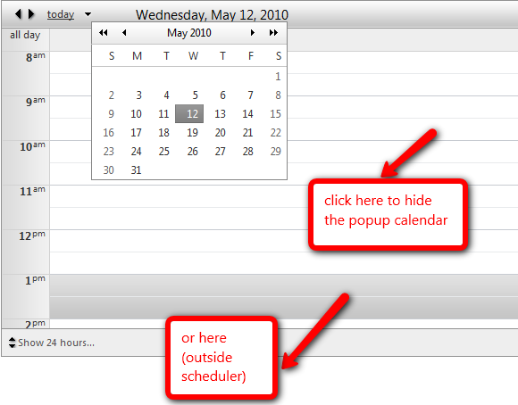

## How to

Hide the popup calendar in RadScheduler by clicking outside of it.   
   
## Description

Jquery and general javascript is used to achieve this.  

  
   
## Solution
   
````JavaScript
window.$ = $telerik.$  
var scheduler = null;         
function pageLoad()   
{  
   scheduler = $find('<%= RadScheduler1.ClientID %>');  
}  
$(document).click(function(event) {  
   var target = event.target || event.srcElement;  
      
   if (!$(target).parents().is(".RadCalendar") & !$(target).is(".rsDatePickerActivator"))   
   {  
         if (scheduler._datePickerCalendarExpanded)  
            scheduler._onDatePickerToggle();  
   }  
});  
````   

 