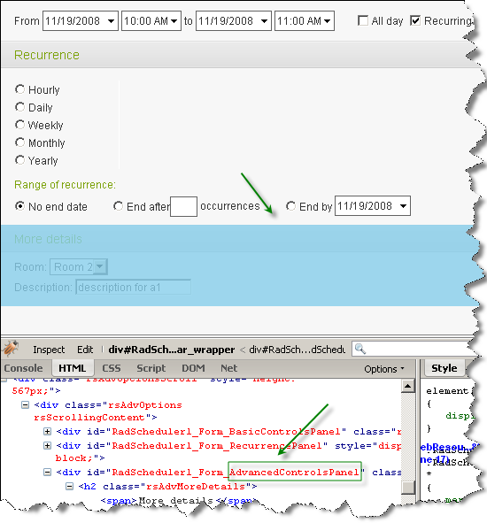
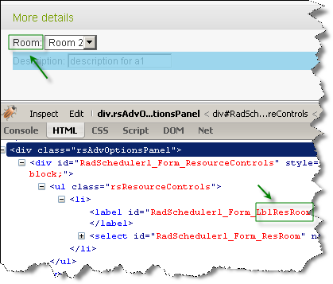

## HOW-TO  
   
Access controls in the advanced form of RadScheduler
   
   
## DESCRIPTION  
   
 RadScheduler's **FormCreated** event allows you to access elements on the advanced form. This is achieved using the **FindControl** method of **e.Container** and passing as an argument the last part of the rendered control's ID. For example, to access the advanced controls' panel, you need to use **e.Container.FindControl("AdvancedControlsPanel")**.
   
 

   
   
   
 The description labels Resources require a different approach since they are WebControls which dynamically add the label. For example, suppose you want to modify the description for the Room's resource:  
 

   
   
 You still need to use the FindControl() method. However, **e.Container.FindControl("LblResRoom")** will return a WebControl. Once you get this WebControl you can clear its children and add a new label dynamically.    
   
   
## SOLUTION
   
````C#  

protected void RadScheduler1_FormCreated(object sender, Telerik.Web.UI.SchedulerFormCreatedEventArgs e)  
{  
    if ((e.Container.Mode == SchedulerFormMode.AdvancedEdit) || (e.Container.Mode == SchedulerFormMode.AdvancedInsert))  
    {  
        //Find and hide the advanced control panel:     
        //Panel advancedPanel = (Panel)e.Container.FindControl("AdvancedControlsPanel");  
        //advancedPanel.Visible = false;     
 
        //Find the Subject textbox and set its Height:     
        RadTextBox subjectTextbox = (RadTextBox)e.Container.FindControl("Subject");  
        subjectTextbox.Height = Unit.Pixel(20);  
        subjectTextbox.Label = "Subject (modified):";  
 
        //Find the RadComboBox control for the Room resource and set its SelectedIndex property.      
        //This is useful if you want to default to a specific resource selection. However,     
        //you should leave only the AdvancedInsert clause from the if statement above.      
        //RadComboBox resRoomDDL = (RadComboBox)e.Container.FindControl("ResRoom");  
        //resRoomDDL.SelectedIndex = 2;  
 
        //Find the TextBox for the Description custom attribute and set its background color and label:     
        RadTextBox attrAnnotationsTextbox = (RadTextBox)e.Container.FindControl("AttrDescription");  
        attrAnnotationsTextbox.BackColor = System.Drawing.Color.Yellow;  
        attrAnnotationsTextbox.Label = "Description(modified): ";  
 
 
        //Change the description for the Room resource:     
        WebControl resWebcontrol1 = (WebControl)e.Container.FindControl("LblResRoom");  
        Label resLabel1 = new Label();  
        resLabel1.Text = "Room(modified):";  
        resWebcontrol1.Controls.Clear();  
        resWebcontrol1.Controls.Add(resLabel1);                         
    }   
} 
````
````VB
Protected Sub RadScheduler1_FormCreated(ByVal sender As Object, ByVal e As Telerik.Web.UI.SchedulerFormCreatedEventArgs) Handles RadScheduler1.FormCreated  

    If (e.Container.Mode = SchedulerFormMode.AdvancedEdit) OrElse (e.Container.Mode = SchedulerFormMode.AdvancedInsert) Then 
        'Find and hide the advanced control panel:     
        'Dim advancedPanel As Panel = DirectCast(e.Container.FindControl("AdvancedControlsPanel"), Panel)  
        'advancedPanel.Visible = False  

        'Find the Subject textbox and set its Height:     
        Dim subjectTextbox As RadTextBox = DirectCast(e.Container.FindControl("Subject"), RadTextBox)  
        subjectTextbox.Height = Unit.Pixel(20)  
        subjectTextbox.Label = "Subject (modified):" 

        'Find the RadComboBox control for the Room resource and set its SelectedIndex property.      
        'This is useful if you want to default to a specific resource selection. However,     
        'you should leave only the AdvancedInsert clause from the if statement above.      
        Dim resRoomDDL As RadComboBox = DirectCast(e.Container.FindControl("ResRoom"), RadComboBox)  
        resRoomDDL.SelectedIndex = 2  

        'Find the TextBox for the Description custom attribute and set its background color and label:     
        Dim attrAnnotationsTextbox As RadTextBox = DirectCast(e.Container.FindControl("AttrDescription"), RadTextBox)  
        attrAnnotationsTextbox.BackColor = System.Drawing.Color.Yellow  
        attrAnnotationsTextbox.Label = "Description(modified):" 

        'Change the description for the Room resource:     
        Dim resWebcontrol1 As WebControl = DirectCast(e.Container.FindControl("LblResRoom"), WebControl)  
        Dim resLabel1 As New Label()  
        resLabel1.Text = "Room: (modified)" 
        resWebcontrol1.Controls.Clear()  
        resWebcontrol1.Controls.Add(resLabel1)  
    End If 

End Sub 
````


  