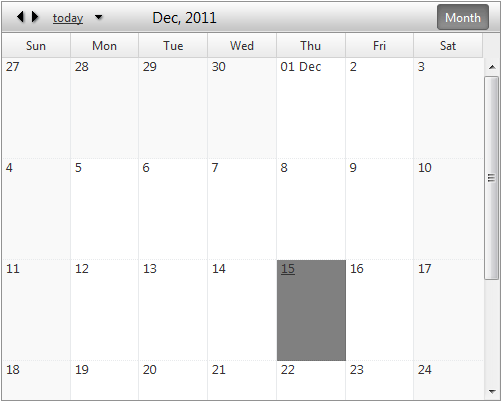

## HOW-TO  
   

Disable the day cells' numbers from navigating to the day represented by the currently selected cell.   
 )  
   
## DESCRIPTION  
   

The day cells in MonthView of the RadScheduler contain a number in the upper left corner which represents a day in the current month. This number is represented by an &lt;a&gt; HTML tag and when clicked it changes the view of the RadScheduler to DayView with the selected cell's day set as current day.   

This KB article shows how to prevent the default action of the aforementioned cells' links and disable the currently selected cell's day to be reviewed in DayView. Please refer to the solution section below, to see how it is achieved.  
   
## SOLUTION  

````ASPX
<script>
function pageLoad()
{
    $telerik.$(".rsDateHeader").click(function (e) { return  false; });
}
</script>
<telerik:RadScheduler ID="RadScheduler1" SelectedView="MonthView"  runat="server">
  <DayView UserSelectable="false" />
  <WeekView UserSelectable="false" />
  <TimelineView UserSelectable="false" />
</telerik:RadScheduler>
````
   
 


