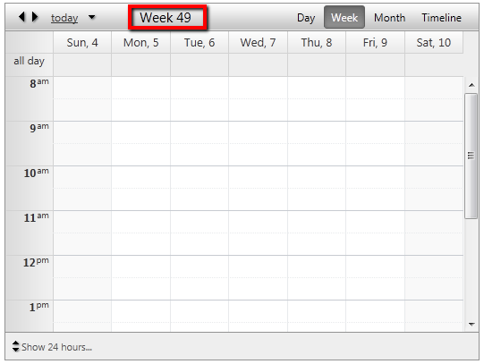

## HOW-TO  
   

Display the week number in the date header.  
   
   
## DESCRIPTION
   

The **HeaderDateFormat** and **ColumnHeaderDateFormat** properties allow you to use [Custom Date and Time Format Strings](http://msdn.microsoft.com/en-us/library/8kb3ddd4.aspx). They can also display custom text in addtion to date information. For example, setting:  
   
 *ColumnHeaderDateFormat=" 'Custom text' dddd"*  

will display: "Custom text Monday". Note that the custom text should be wrapped in single quotes.   
   

However, for some special kind of customization you can use a hidden field to store information from the server and then apply it to the date header via jQuery. The following code demonstrates this technique.  
   
## SOLUTION  
   
````ASPX
<script type="text/javascript">
   function pageLoad() {
      var weekNumber = document.getElementById("HiddenField1").value;
      $telerik.$(".rsHeader h2").text("Week " + weekNumber);
   }
</script>
<asp:HiddenField ID="HiddenField1" runat="server" />
<telerik:RadScheduler runat="server" ID="RadScheduler1" SelectedView="WeekView" OnNavigationComplete="RadScheduler1_NavigationComplete">
      <WeekView ColumnHeaderDateFormat="'Custom text' d" />
</telerik:RadScheduler>
````

````C#
protected void Page_Load(object sender, EventArgs e)
   {
       HiddenField1.Value = GetWeekNumber(RadScheduler1.SelectedDate).ToString();
   }
 
   protected void RadScheduler1_NavigationComplete(object sender, SchedulerNavigationCompleteEventArgs e)
   {
       RadScheduler scheduler = (RadScheduler) sender;
       HiddenField1.Value = GetWeekNumber(scheduler.SelectedDate).ToString();
   }
 
   public static int GetWeekNumber(DateTime dtPassed)
   {
       CultureInfo ciCurr = CultureInfo.CurrentCulture;
       int weekNum = ciCurr.Calendar.GetWeekOfYear(dtPassed, CalendarWeekRule.FirstFourDayWeek, DayOfWeek.Monday);
       return weekNum;
   }
````
   
````VB
Protected Sub Page_Load(sender As Object, e As EventArgs)
    HiddenField1.Value = GetWeekNumber(RadScheduler1.SelectedDate).ToString()
End Sub
 
Protected Sub RadScheduler1_NavigationComplete(sender As Object, e As SchedulerNavigationCompleteEventArgs)
    Dim scheduler As RadScheduler = DirectCast(sender, RadScheduler)
    HiddenField1.Value = GetWeekNumber(scheduler.SelectedDate).ToString()
End Sub
 
Public Shared Function GetWeekNumber(dtPassed As DateTime) As Integer
    Dim ciCurr As CultureInfo = CultureInfo.CurrentCulture
    Dim weekNum As Integer = ciCurr.Calendar.GetWeekOfYear(dtPassed, CalendarWeekRule.FirstFourDayWeek, DayOfWeek.Monday)
    Return weekNum
End Function
````
   
 


   