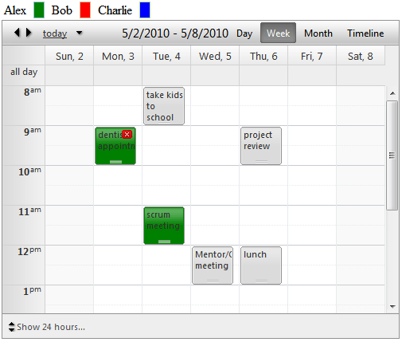

   
## How to
   

Highlight all visible appointments of the same resource when clicking on an appointment.  
   
  
   
   
## Description

Appointments of various resources are displayed. Clicking on an appointment will highlight with custom color all appointments with the same resource. For this solution:  
 - Assign a 'Color' attribute for the Resources in RadScheduler's DataBound event handler.

 - On OnClientAppointmentClick, access appointment's resources client-side and loop through all visible appointments of RadScheduler client-side.

 - Set the appointment backColor property client-side based on the resource attribute.

 - Finally, clear the backColor on timeslotclick or appointment click.

## Solution
   
````JavaScript 
function OnClientAppointmentClick(sender, eventArgs) {
   var clickedAppResource = eventArgs.get_appointment().get_resources().getResourceByType("User");
   if (clickedAppResource != null) {
      sender.get_appointments().forEach(function(app) {
            app.set_backColor("");
            var currentAppResource = app.get_resources().getResourceByType("User");
            //create you condition based on custom attribute or resource 
            if ((currentAppResource != null) && (clickedAppResource.get_text() == currentAppResource.get_text()))
               app.set_backColor(currentAppResource.get_attributes().getAttribute("Color"));
      });
   }
}
function OnClientTimeSlotClick(sender, eventArgs) {
   sender.get_appointments().forEach(function(app) {
      //clear the selected style: 
      app.set_backColor("");
   });
}
````
   
Here you can store your choice of color in the resource attributes collection:  
   
````C#
protected void RadScheduler1_DataBound(object sender, EventArgs e)
    {
        foreach (Resource res in RadScheduler1.Resources.GetResourcesByType("User"))
        {
            switch (res.Key.ToString())
            {
                case "1":
                    res.Attributes["Color"] = "green";
                    break;
                case "2":
                    res.Attributes["Color"] = "red";
                    break;
                case "3": 
                    res.Attributes["Color"] = "blue";
                    break;
                default: break;
            }
        }
    }
````
````VB
Protected Sub RadScheduler1_DataBound(ByVal sender As Object, ByVal e As EventArgs) Handles RadScheduler1.DataBound
        For Each res As Resource In RadScheduler1.Resources.GetResourcesByType("User")
            Select Case res.Key.ToString()
                Case "1"
                    res.Attributes("Color") = "green"
                    Exit Select
                Case "2"
                    res.Attributes("Color") = "red"
                    Exit Select
                Case "3"
                    res.Attributes("Color") = "blue"
                    Exit Select
                Case Else
                    Exit Select
            End Select
        Next
End Sub
````

 