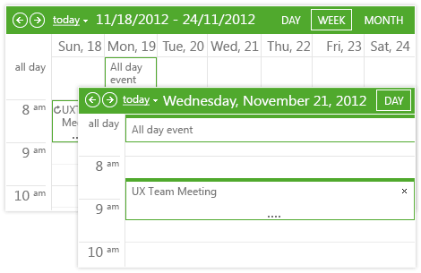

## How to  
   
Highlight the days that have at least one appointment in the pop-up calendar.
   

   
## Description
   
The user cannot easily see the appointments that are not included in the currently selected view.  

Instead of going through the Scheduler to find appointments, an easier way is to have the dates which have appointments highlighted in the popup RadCalendar. Here's how this is achieved:

 - Subscribe to the  **OnPreRender** event of the RadScheduler.

 - Find the RadCalendar control located in the RadScheduler.

 - In the **OnPreRender** handler, access and loop through all visible appointments of RadScheduler. Get the Start of each appointment, format it's style by a CssClass and add it in the **SpecialDays** **Collection** of the RadCalendar.

 
## Solution

````C#
protected void RadScheduler1_PreRender(object sender, EventArgs e)
{
   RadCalendar popupCalendar = RadScheduler1.FindControl("SelectedDateCalendar") as RadCalendar;
   if (popupCalendar != null)
   {
      popupCalendar.Skin = "Sunset";

      foreach (Appointment a in RadScheduler1.Appointments)
      {
            RadCalendarDay dayWithAppointment = new RadCalendarDay();
            dayWithAppointment.ToolTip = a.Subject;
            dayWithAppointment.Date = a.Start;
            dayWithAppointment.ItemStyle.CssClass = "DayWithAppointments";
            popupCalendar.SpecialDays.Add(dayWithAppointment);
      }
   }
}
````
````VB
Protected Sub RadScheduler1_PreRender(ByVal sender As Object, ByVal e As EventArgs)
   Dim popupCalendar As RadCalendar = TryCast(RadScheduler1.FindControl("SelectedDateCalendar"), RadCalendar)
   If popupCalendar IsNot Nothing Then
      popupCalendar.Skin = "Sunset"

      For Each a As Appointment In RadScheduler1.Appointments
            Dim dayWithAppointment As New RadCalendarDay()
            dayWithAppointment.ToolTip = a.Subject
            dayWithAppointment.[Date] = a.Start
            dayWithAppointment.ItemStyle.CssClass = "DayWithAppointments"
            popupCalendar.SpecialDays.Add(dayWithAppointment)
      Next
   End If
End Sub
````

````CSS
.DayWithAppointments {
   background-color: Red;
}
````

 