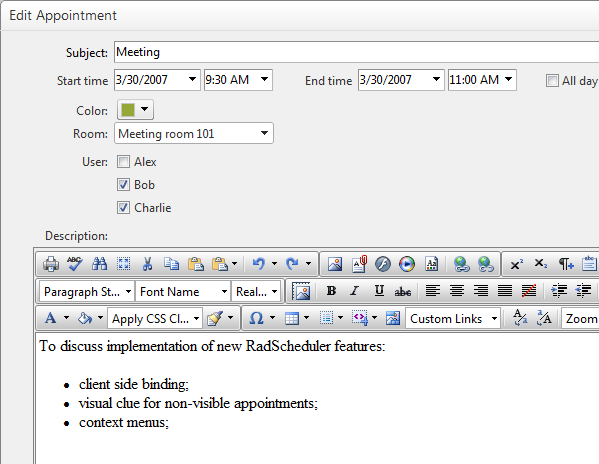
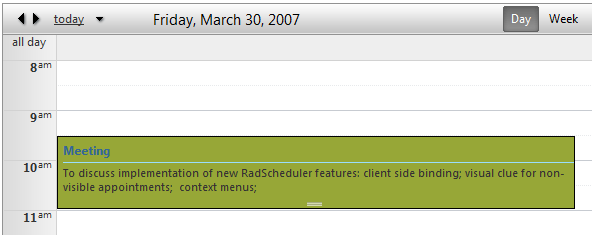

## HOW-TO  
   
 Integrate RadEditor in the advanced form of RadScheduler  
   
## DESCRIPTION 
   
 RadEditor replaces the Description field of the advanced form. It's content is saved in the Description field and the stripped down plain text of the content (no formatting) is saved in a custom attribute - DescriptionPlainText. The DescriptionPlainText custom attribute is used for description in the AppointmentTemplate.   
   
**Advanced form:**

   
   
 **Appointment template:**  
   
   
 ## SOLUTION  
   
 Download a working sample from [here](/support/kb/aspnet-ajax/scheduler/sample-project-of-the-customizing-the-advanced-template-example.aspx?) (SchedulerCustomAdvancedFormQ3\_SP1\_2009.zip). Then edit **AdvancedForm.ascx** to comment the description RadTextBox and add a RadEditor control and a description label like this:   
   
 ````ASP.NET
<%-- <telerik:RadTextBox runat="server" ID="DescriptionText" TextMode="MultiLine" Columns="50"
                   Rows="5" Width="100%" Label='<%# Owner.Localization.AdvancedDescription + ":" %>' 
                   Text='<%# Eval("Description") %>' />--%> 
 
<label>  
  <%= Owner.Localization.AdvancedDescription%>:
</label>
<telerik:RadEditor ID="DescriptionText" runat="server"> 
</telerik:RadEditor>
 ````
 
   
 In code-behind of **AdvancedForm**.ascx modify the Description property and expose a new one - DescriptionPlainText as follows:  
   
 ````C#
[Bindable(BindableSupport.Yes, BindingDirection.TwoWay)]
public string Description
{
    get
    {
        return DescriptionText.Content;
    }

    set
    {
        DescriptionText.Content = value;
    }
}
[Bindable(BindableSupport.Yes, BindingDirection.OneWay)]
public string DescriptionPlainText
{
    get
    {
        return DescriptionText.Text;
    }
}
 ````   
 ````VB 
<Bindable(BindableSupport.Yes, BindingDirection.TwoWay)> _
Public Property Description() As String
    Get
        Return DescriptionText.Content
    End Get
  
    Set
        DescriptionText.Content = value
    End Set
End Property
<Bindable(BindableSupport.Yes, BindingDirection.OneWay)> _
Public ReadOnly Property DescriptionPlainText() As String
    Get
        Return DescriptionText.Text
    End Get
End Property
 ````
 
   
 In **Default.aspx** make the following changes:  
 
````ASP.NET
<telerik:RadScheduler runat="server" ID="RadScheduler1" Width="650px"
    SelectedDate="2007-03-30" TimeZoneOffset="03:00:00"
    OnDataBound="RadScheduler1_DataBound"
    OnAppointmentDataBound="RadScheduler1_AppointmentDataBound"
    OnClientFormCreated="schedulerFormCreated"
    CustomAttributeNames="AppointmentColor, DescriptionPlainText"
    EnableDescriptionField="true">
    <AdvancedForm Modal="true" />
    <AppointmentTemplate>
        <div class="rsAptSubject">
            <%# Eval("Subject") %>
        </div>
        <%# Eval("DescriptionPlainText")%>
    </AppointmentTemplate>
    <AdvancedEditTemplate>
        <scheduler:AdvancedForm runat="server" ID="AdvancedEditForm1" Mode="Edit"
            Subject='<%# Bind("Subject") %>'
            Description='<%# Bind("Description") %>' 
            DescriptionPlainText='<%# Bind("DescriptionPlainText") %>'
            Start='<%# Bind("Start") %>'
            End='<%# Bind("End") %>'
            RecurrenceRuleText='<%# Bind("RecurrenceRule") %>'
            AppointmentColor='<%# Bind("AppointmentColor") %>' 
            UserID='<%# Bind("User") %>'
            RoomID='<%# Bind("Room") %>' />
    </AdvancedEditTemplate>
    <AdvancedInsertTemplate>
        <scheduler:AdvancedForm runat="server" ID="AdvancedInsertForm1" Mode="Insert"
            Subject='<%# Bind("Subject") %>'
            Start='<%# Bind("Start") %>'
            End='<%# Bind("End") %>'
            Description='<%# Bind("Description") %>'
            DescriptionPlainText='<%# Bind("DescriptionPlainText") %>'
            RecurrenceRuleText='<%# Bind("RecurrenceRule") %>'
            AppointmentColor='<%# Bind("AppointmentColor") %>'  
            UserID='<%# Bind("User") %>'
            RoomID='<%# Bind("Room") %>' />
    </AdvancedInsertTemplate>
    <TimelineView UserSelectable="false" />
    <TimeSlotContextMenuSettings EnableDefault="true" />
    <AppointmentContextMenuSettings EnableDefault="true" />                 
</telerik:RadScheduler>
````


You can download a sample project from [here](files/scheduler-radeditor-in-advanced-form-of-radscheduler.zip).

 