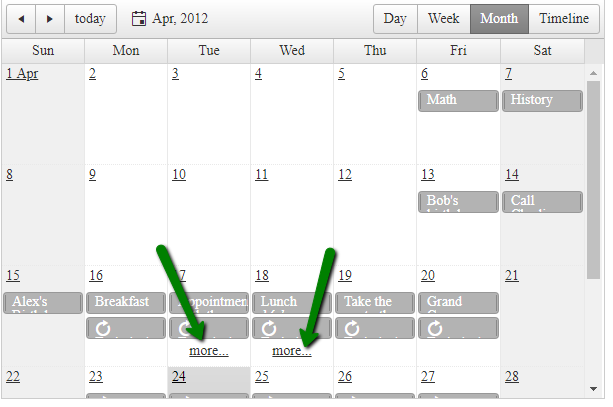

## How to 

Change the default behavior of the "Show More..." button in MonthView of the Scheduler.



## Solution

- **Option 1**: Override the functionality of all Schedulers

````JavaScript
// Override all schedulers' show more button click
Telerik.Web.UI.RadScheduler.prototype._onShowMoreClick = function (e) {
    $telerik.cancelRawEvent(e);
    var slot = this._activeModel.getTimeSlotFromDomElement(e.eventMapTarget);
    //return this._switchToSelectedDay(slot.get_startTime());

    //Navigate here to the custom page
    window.location.href = "https://google.com";

    return false;
}
````

- **Option 2**: Override the functionality of a single Scheduler

````JavaScript
// Override a single scheduler's show more button click
function changeMoreButtonClickFunction() {
    var scheduler = $find("<%= RadScheduler1.ClientID %>");
    $telerik.$(scheduler.get_element()).find(".rsShowMore")
        .off("click")
        .on("click", function (e) {
            $telerik.cancelRawEvent(e);
            var slot = scheduler._activeModel.getTimeSlotFromDomElement(e.target);

            //Navigate here to the custom page
            window.location.href = "https://google.com";

            return false;
        });
}
Sys.Application.add_load(changeMoreButtonClickFunction);
````

 