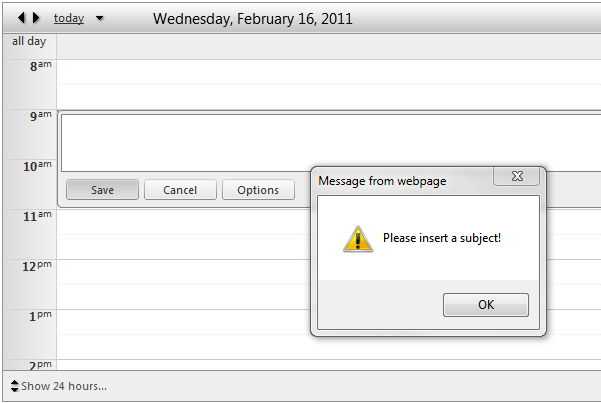

## How to  
   
Prevent inserting of appointments when no subject is specified in the Inline Form.  
   
  
   
## Description
   
At this moment you are not allowed to create appointments without specifying their subject in the Advanced Form. This is achieved with the help of **RequiredFieldValidator** in the Advanced Form. However there is no limitation when using the Inline Form.   
   
## Solution
   
The solution is achieved by using **JQuery**. You'll need to subscribe to the **OnClientFormCreated** event and use the following code in the handler:  

````JavaScript
function OnClientFormCreated(sender, args) {
   var $ = $telerik.$;
   $(".rsAptEditConfirm").bind({
         click: function() {
            var subject = $('.rsAptEditTextareaWrapper').children();
            var text = subject.val();
            if (text == '') {
               alert('Please insert a subject!');
               return false;
            }
         }
   });
}
````

## Restrictions
   
Please note that if you subscribe to the server-side event **OnFormCreated** - you need to move the logic in the **OnClientFormCreated** event in the **pageLoad():**  


````JavaScript
function pageLoad() { 
   var $ = $telerik.$; 
   $(".rsAptEditConfirm").bind({ 
         click: function() { 
            var subject = $('.rsAptEditTextareaWrapper').children(); 
            var text = subject.val(); 
            if (text == '') { 
               alert('Please insert a subject!'); 
               return false; 
            } 
         } 
   }); 
}
````

 