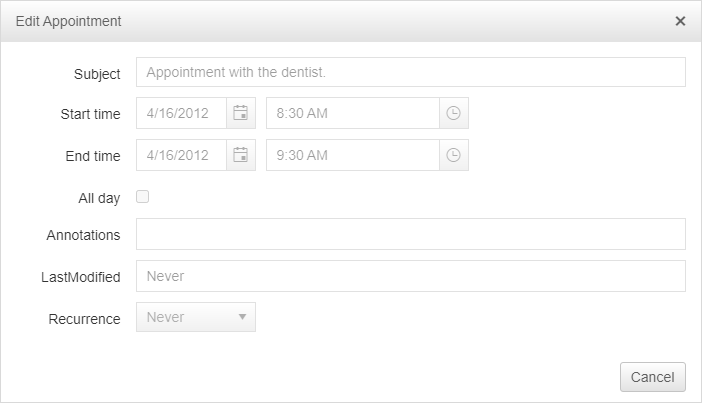

## How to

Disable editing in [RadScheduler]()'s Advanced Form and make it read-only.

## Solution

To make the Advanced Form read-only you can disable all embedded controls and hide the Save button in the [OnFormCreated event]().

>caption Example



>note The following code is working for the built-in advanced form. In case [Advanced Templates](https://demos.telerik.com/aspnet-ajax/scheduler/examples/advancedformtemplate/defaultcs.aspx) are used, the panels can accessed directly by ID.


````C#
protected void RadScheduler1_FormCreated(object sender, SchedulerFormCreatedEventArgs e)
{
    if (e.Container.Mode == SchedulerFormMode.AdvancedEdit)
    {
        var body = e.Container.Controls[0].Controls[1];
        var bodyPanel = body.Controls[0] as WebControl;
        bodyPanel.Enabled = false;
        var buttonPanel = body.Controls[1];
        var saveButton = buttonPanel.Controls[0] as LinkButton;
        saveButton.Visible = false;
    }
}
````
````VB
Protected Sub RadScheduler1_FormCreated(ByVal sender As Object, ByVal e As SchedulerFormCreatedEventArgs)
    If e.Container.Mode = SchedulerFormMode.AdvancedEdit Then
        Dim body = e.Container.Controls(0).Controls(1)
        Dim bodyPanel = TryCast(body.Controls(0), WebControl)
        bodyPanel.Enabled = False
        Dim buttonPanel = body.Controls(1)
        Dim saveButton = TryCast(buttonPanel.Controls(0), LinkButton)
        saveButton.Visible = False
    End If
End Sub
````


An alternative option is to disable the editing of the control and instead show an external popup with the needed information. The following resources show how to edit the appointments in External popup, it can be modified to just show the information:

 - [External Edit in RadDock](https://demos.telerik.com/aspnet-ajax/scheduler/examples/raddock/defaultcs.aspx)

 - [Replace the Edit Form](https://docs.telerik.com/devtools/aspnet-ajax/controls/scheduler/how-to/replace-the-edit-form)


>important Client-side validation is executed by the client and can be easily bypassed. Therefore we recommend subscribing to the Insert/Update/Delete server-side events and cancel them in case the user is not allowed to do this action.


