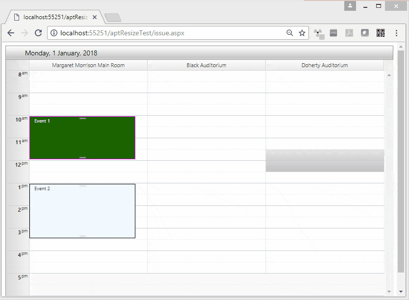

### PROBLEM

When I drag the top bar of an appointment (the start time), it causes the end time to increase - the appointment gets "longer". This is only a UI issue, as when I stop dragging and the [OnClientAppointmentResizeEnd]() event fires, the end time is still the original end time and when the scheduler is rebound, all looks fine. Replicated only in Classic render mode.

### DESCRIPTION

The issue stems from custom border styles set to the appointments in the AppointmentDataBound event. The presence of the inline rules causes issues with the size calculation logic.

### SOLUTION

Use the [Lightweight RenderMode](). This will also allow you to easily use CSS to style the appointments, instead of inline rules.

