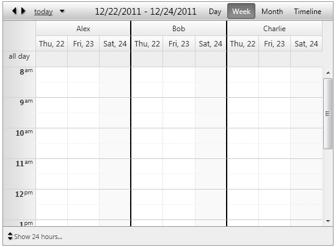

## HOW-TO

Separate resource groups with custom border style in RadScheduler

  
   
   
## DESCRIPTION  
   

The server-side TimeSlotCreated event is handled to tag the last cells for each resource group and set the border style.  jQuery is used to add border to the headers.   

      
## SOLUTION

````ASPX
<script type="text/javascript">
 
    function pageLoad() {
 
        var $ = $telerik.$;
        var sch = $find('<%=RadScheduler1.ClientID %>');
        var schElement = sch.get_element();
        var resCount = sch.get_resources().getResourcesByType(sch.get_groupBy()).get_count();
        var resColumns = $(".rsHorizontalHeaderTable tr:nth-child(2) > th", schElement).size() / resCount;
 
        $(".rsHorizontalHeaderTable tr:first > th:not('th:last')", schElement).css("border-right", "solid 2px black");
        $(".rsHorizontalHeaderTable tr:nth-child(2) > th:not('th:last')", schElement).each(function (i) {
            if ((i + 1) % resColumns == 0)
                $(this).css("border-right", "solid 2px black");
        });
    }
 
</script>
<telerik:RadScheduler ID="RadScheduler1" runat="server" GroupBy="User" FirstDayOfWeek="Thursday"
    SelectedView="TimelineView" OnTimeSlotCreated="RadScheduler1_TimeSlotCreated">
    <TimelineView NumberOfSlots="2" SlotDuration="03:00:00" />
</telerik:RadScheduler>
````
   
````C#
protected void RadScheduler1_TimeSlotCreated(object sender, TimeSlotCreatedEventArgs e)
{
   RadScheduler scheduler1 = (RadScheduler)sender;
   int lastResIndex = scheduler1.Resources.GetResourcesByType(scheduler1.GroupBy).Count - 1;

   if (scheduler1.GroupBy != null)
   {
      if (e.TimeSlot.Resource.Key.ToString() != scheduler1.Resources.GetResourcesByType("User")[lastResIndex].Key.ToString()) //This check excludes the last resource. 
      {
            if (scheduler1.SelectedView == SchedulerViewType.DayView)
            {
               e.TimeSlot.Control.Style.Add("border-right", "solid 2px black");
            }

            else if (scheduler1.SelectedView == SchedulerViewType.TimelineView)
            {
               if (e.TimeSlot.End == scheduler1.VisibleRangeEnd)
                  e.TimeSlot.Control.Style.Add("border-right", "solid 2px black");
            }

            else if (e.TimeSlot.Start.DayOfWeek == scheduler1.LastDayOfWeek)
            {
               e.TimeSlot.Control.Style.Add("border-right", "solid 2px black");
            }
      }
   }
}
````

````VB
Protected Sub RadScheduler1_TimeSlotCreated(sender As Object, e As TimeSlotCreatedEventArgs)
   Dim scheduler1 As RadScheduler = DirectCast(sender, RadScheduler)
   Dim lastResIndex As Integer = scheduler1.Resources.GetResourcesByType(scheduler1.GroupBy).Count - 1

   If scheduler1.GroupBy <> Nothing Then
      If e.TimeSlot.Resource.Key.ToString() <> scheduler1.Resources.GetResourcesByType("User")(lastResIndex).Key.ToString() Then
            'This check excludes the last resource. 
            If scheduler1.SelectedView = SchedulerViewType.DayView Then
               e.TimeSlot.Control.Style.Add("border-right", "solid 2px black")

            ElseIf scheduler1.SelectedView = SchedulerViewType.TimelineView Then
               If e.TimeSlot.[End] = scheduler1.VisibleRangeEnd Then
                  e.TimeSlot.Control.Style.Add("border-right", "solid 2px black")
               End If

            ElseIf e.TimeSlot.Start.DayOfWeek = scheduler1.LastDayOfWeek Then
               e.TimeSlot.Control.Style.Add("border-right", "solid 2px black")
            End If
      End If
   End If
End Sub
````
 

   