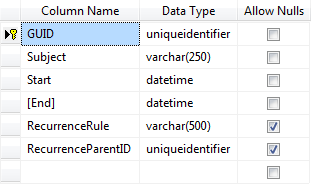

   
## HOW-TO   
   
 Use GUIDs as appointment primary keys with SQL Server.  
   
## DESCRIPTION  
   
 Suppose that you store appointements' information in two data tables which you will merge at some point. In such cases you can use GUIDs as the appointment primary key to avoid loss of information. The major advantage of using GUIDs is that they are unique across all space and time.   
   
 However, unlike an IDENTITY column, a uniqueidentifier column doesn't automatically get an assigned value when a row is inserted into a table. You either need to place a default on the uniqueidentifier column (DEFAULT NEWID()), or do something like the following:   
   
 DECLARE @GUID uniqueidentifier   
 SET @GUID = NEWID()   
 INSERT Item VALUES (@GUID,'Yak Hoof')   
   
 Note: if you're using the column as the primary key, you may as well define it as the ROWGUID for the table, in which case it will be automatically assigned a new GUID when an entry is inserted.  
   
   
## SOLUTION  
   
 Create a data table as follows:  
   
   
 Follow steps 1~4 from the help on  [Declarative Databinding](https://docs.telerik.com/devtools/aspnet-ajax/introduction)  
   
 Replace @GUID with NEWID() in the InsertCommand statement:  
 
 ````
 InsertCommand="INSERT INTO [Appointments] ([GUID], [Subject], [Start], [End], [RecurrenceRule], [RecurrenceParentID]) VALUES (NEWID(), @Subject, @Start, @End, @RecurrenceRule, @RecurrenceParentID)"
 ````
 
   
 Remove *&lt;asp:Parameter Name="GUID" Type="Object" /&gt;* from the InserParameters collection:  
   
 ````
 <InsertParameters> 
      <asp:Parameter Name="GUID" Type="Object" /> 
      <asp:Parameter Name="Subject" Type="String" /> 
      <asp:Parameter Name="Start" Type="DateTime" /> 
      <asp:Parameter Name="End" Type="DateTime" /> 
      <asp:Parameter Name="RecurrenceRule" Type="String" /> 
      <asp:Parameter Name="RecurrenceParentID" /> 
  </InsertParameters> 
 ````
   
 Remove the type for RecurrenceParentID in the Insert and Update parameters:  
   
````
* * *  
 <asp:Parameter Name="RecurrenceParentID" />
* * *
````
   
   
 Attached is a [demo project](files/scheduler-using-guid-as-uniqueidentifier.zip).   


