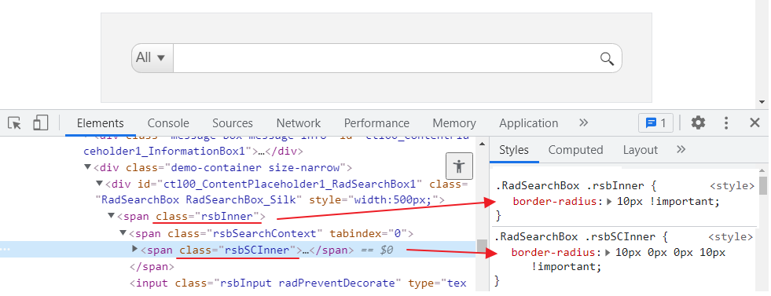

## How to 

Add border-radius on RadSearchBox to achieve Rounded corners.

## Solution

There are two CSS classes to set to render the searchbox with rounded corners:

````CSS
.RadSearchBox .rsbSCInner {
    border-radius: 10px 0px 0px 10px !important;
}

.RadSearchBox .rsbInner {
    border-radius: 10px !important;
}
````



For further customization, you can follow the suggestions in the first two points of the [Improve Your Debugging Skills with Chrome DevTools](https://www.telerik.com/blogs/improve-your-debugging-skills-with-chrome-devtools) blog post explaining how to inspect the generated HTML and check the applied styles for various elements. 

 - [Inspect the Generated HTML of a Control](https://www.telerik.com/blogs/improve-your-debugging-skills-with-chrome-devtools#inspect-the-generated-html-of-a-control)

 - [See the Applied Styles](https://www.telerik.com/blogs/improve-your-debugging-skills-with-chrome-devtools#see-the-applied-styles)

