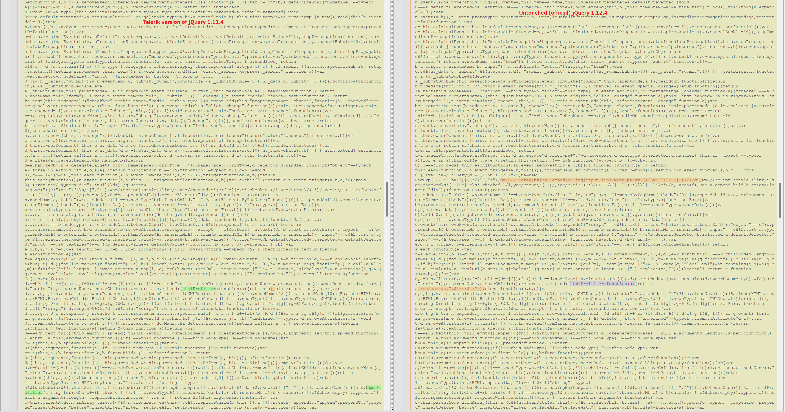
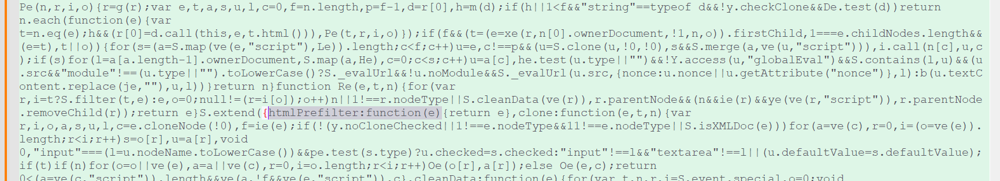
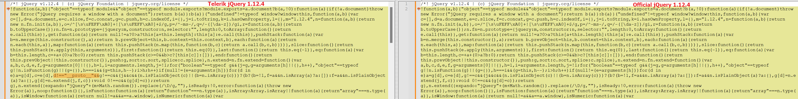

# Environment
| Property | Value |
| --- | --- |
| Product | Telerik Web UI for ASP.NET AJAX |
| Version | all |

# Description
I would like to address the reported vulnerabilities in jQuery within Telerik Web UI for ASP.NET AJAX. Our client (scanner tool) detected a jQuery script with a vulnerable version (1.12.4) that is not present in our JS library. Our application is currently using the latest version of Telerik Web UI, and an updated jQuery version v3.7. We need guidance on how to resolve this issue as soon as possible.

# Solution
As per the [Telerik documentation](https://docs.telerik.com/devtools/aspnet-ajax/integration/jquery/using-jquery#embedded-jquery-security), Telerik Web UI versions after R1 2019 include a custom version of jQuery (1.12.4) with backport fixes for known vulnerabilities in jQuery 1.12.4. This custom version was necessary due to limitations in the Microsoft AJAX framework used in ASP.NET WebForms.

## CVE reports:
To address the reported vulnerabilities, we have introduced several security enhancements to the custom jQuery script within the Telerik.Web.UI assembly. These enhancements address the following CVE reports:

- CVE-2020-11022 & CVE-2020-11023: [Cross-site scripting (XSS) vulnerability in jQuery.htmlPrefilter fixed in jQuery 3.5](https://blog.jquery.com/2020/04/10/jquery-3-5-0-released/) - from version R2 2020
- CVE-2015-9251 (included in your report): [jQuery before 3.0.0 is vulnerable to Cross-site Scripting (XSS) attacks when a cross-domain Ajax request is performed without the dataType option, causing text/javascript responses to be executed](https://www.cvedetails.com/cve/CVE-2015-9251/) - from version R1 2019
- CVE-2019-11358: [Query before 3.4.0, as used in Drupal, Backdrop CMS, and other products, mishandles jQuery.extend(true, {}, ...) because of Object.prototype pollution. If an unsanitized source object contained an enumerable __proto__ property, it could extend the native Object.prototype](https://www.cvedetails.com/cve/CVE-2019-11358/) - from version R1 2019
- [CVE-2020-23064](https://nvd.nist.gov/vuln/detail/CVE-2020-23064) (sometimes this CVE gets flagged too) - it occurs in jQuery 2.2.0 through 3.x before 3.5.0 and thus does not exist in jQuery version 1.12.4 embedded within the Telerik.Web.UI.dll.

## Evidence of Mitigation:
To confirm that the vulnerabilities have been mitigated, you can compare the embedded jQuery 1.12.4 file (Telerik CDN URL: https://d2i2wahzwrm1n5.cloudfront.net/ajaxz/2023.3.1010/Common/jQuery.js) with the official jQuery version (URL: https://code.jquery.com/jquery-1.12.4.min.js).

The Cross-Site Scripting (CVE-2020-11022) vulnerability about the jQuery.htmlPrefilter function is discussed in the https://blog.jquery.com/2020/04/10/jquery-3-5-0-released/ blog post. To confirm that it is fixed in the modified version distributed by Telerik AJAX control, you can compare the embedded jQuery 1.12.4 file (this is the Telerik CDN url https://d2i2wahzwrm1n5.cloudfront.net/ajaxz/2023.3.1010/Common/jQuery.js) with the official jQuery version https://code.jquery.com/jquery-1.12.4.min.js (the URL is provided in https://releases.jquery.com/). Here is a comparison between both files:

We have applied the fix available in jQuery 3.5 and 3.7.1. Here is the fix in 3.5:

Parameter Pollution (CVE-2019-11358) is discussed in https://www.cvedetails.com/cve/CVE-2019-11358/ and https://www.privacy-wise.com/mitigating-cve-2019-11358-in-old-versions-of-jquery/. Here is a comparison between our version and the official one of 1.12.4:

This custom version of jQuery 1.12.4 was necessary due to limitations in the Microsoft AJAX framework used in ASP.NET WebForms. However, if you want to use a newer version of jQuery, you can configure the Telerik Ajax controls to use an external jQuery. You can disable the embedded jQuery library and include an external one as a replacement. This lets you use your version for the $telerik.$ variable, which exposes the embedded jQuery library. That way you can have complete control over the used version of jQuery. You can find instructions on how to use external jQuery in the [Including external jQuery](https://docs.telerik.com/devtools/aspnet-ajax/integration/jquery/using-jquery#including-external-jquery) section. You will need just to test extensively your application for:

- JavaScript errors,
- UI component malfunctions,
- AJAX request issues

which are common areas of concern when updating jQuery versions, since there isn't built-in compatibility between ASP.NET Web Forms (MS AJAX) and the latest jQuery version.

For cross-browser support, we haven't upgraded to jQuery 3.x. However, if Firefox isn't a significant browser for your user base, you might consider upgrading to jQuery 3.7 or later. Notably, when we transitioned to jQuery 3.3.1 in 2018, most compatibility issues were with Firefox, as detailed in this [Telerik forum](https://www.telerik.com/forums/known-issues-and-important-changes#4411795) post. It's worth noting that Firefox's popularity has declined since then. However, be cautious: our suite hasn't been tested with the latest jQuery version, so potential new issues remain uncertain.

Firefox is not so popular nowadays and we have not encountered any negative feedback from customers who have upgraded to jQuery 3.x. Your experiences and insights are valuable to us, and we would greatly appreciate it if you could share the outcomes of your upgrade once completed. This feedback not only helps us understand the impact of such upgrades but also assists us in providing better guidance and support to our user community in the future.

## Addressing Scanner Flags:

Should your security scanner persist in flagging the embedded jQuery version, I recommend reaching out to the scanner's vendor for specific reasons why this occurs, especially given that:

- The vulnerabilities in question have been addressed in the embedded jQuery file within the Telerik.Web.UI.dll assembly.
- OR If you want to use a newer version of jQuery, you can configure the Telerik Ajax controls to use an external jQuery. You can disable the embedded jQuery library and include an external one as a replacement. This lets you use your version for the $telerik.$ variable, which exposes the embedded jQuery library. That way you can have complete control over the used version of jQuery. You can find instructions on how to use external jQuery in the [Including external jQuery](https://docs.telerik.com/devtools/aspnet-ajax/integration/jquery/using-jquery#including-external-jquery) section.

   
