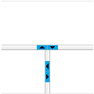

## Description

This article provides two possible approaches for modifying the default collapse/expand buttons of the split bars in RadSplitter. You can choose between using custom image buttons, or enlarging the default font icon arrows, along with increasing the width of the Splitbar and the corresponding html elements.

## Solutions

### Option 1: Use custom expand/collapse icons

Set the desired Splitbar width through the Splitter's `SplitBarsSize` property and pass the path to the chosen custom icons to the collapse/expand button elements (you will also need to modify the default dimensions of the buttons):  

**DOWNLOAD** the icons used in this sample here: [splitter-custom-collapse-expand-icons.zip](files/splitter-custom-collapse-expand-icons.zip)
  


````ASP.NET
<telerik:RadSplitter ID="RadSplitter1" runat="server" Orientation="Horizontal" SplitBarsSize="20">
    <telerik:RadPane ID="RadPane1" runat="server"></telerik:RadPane>
    <telerik:RadSplitBar ID="RadSplitbar1" runat="server" CollapseMode="Both" Height="20"></telerik:RadSplitBar>
    <telerik:RadPane ID="RadPane2" runat="server" Scrolling="None">
        <telerik:RadSplitter ID="RadSplitter2" runat="server" Orientation="Vertical" SplitBarsSize="20">
            <telerik:RadPane ID="RadPane3" runat="server"></telerik:RadPane>
            <telerik:RadSplitBar ID="RadSplitbar2" runat="server" CollapseMode="Both" Width="20"></telerik:RadSplitBar>
            <telerik:RadPane ID="RadPane4" runat="server">
            </telerik:RadPane>
        </telerik:RadSplitter>
    </telerik:RadPane>
</telerik:RadSplitter>
````

````CSS
<style>
    /*Vertical Splitbars*/
    .rspCollapseBarExpand, .rspCollapseBarExpandOver,
    .rspCollapseBarCollapse, .rspCollapseBarCollapseOver {
        height: 45px !important; /*the height of your button-image */
        line-height: 45px !important; /*the height of your button-image */
        width: 20px !important;
        background-position: 0 !important;
        content: unset !important;
    }


    .rspCollapseBarExpand {
        background-image: url("./icons/btn-right.png") !important;
    }

    .rspCollapseBarExpandOver {
        background-image: url("./icons/btn-right-hover.png") !important;
    }

    .rspCollapseBarCollapse {
        background-image: url("./icons/btn-left.png") !important;
    }

    .rspCollapseBarCollapseOver {
        background-image: url("./icons/btn-left-hover.png") !important;
    }

    .RadSplitter .rspCollapseBarExpand:before,
    .RadSplitter .rspCollapseBarCollapse:before {
        content: unset !important;
    }

    /*Horizontal Splitbars*/
    .rspCollapseBarHorizontalExpand, .rspCollapseBarHorizontalExpandOver,
    .rspCollapseBarHorizontalCollapse, .rspCollapseBarHorizontalCollapseOver {
        height: 20px !important; /*the height of your button-image */
        line-height: 20px !important; /*the height of your button-image */
        width: 45px !important;
        background-position: 0 !important;
    }

    .rspCollapseBarHorizontalExpand {
        background-image: url("./icons/btn-down.png") !important;
    }

    .rspCollapseBarHorizontalExpandOver {
        background-image: url("./icons/btn-down-hover.png") !important;
    }

    .rspCollapseBarHorizontalCollapse {
        background-image: url("./icons/btn-up.png") !important;
    }

    .rspCollapseBarHorizontalCollapseOver {
        background-image: url("./icons/btn-up-hover.png") !important;
    }

    .RadSplitter .rspCollapseBarHorizontalCollapse:before,
    .RadSplitter .rspCollapseBarHorizontalExpand:before {
        content: unset !important;
    }
</style>
````


### Option 2: Enlarge the default collapse/expand icons

Set the desired Splitbar width through the Splitter's **SplitBarsSize** property and overwrite the following styles in order to enlarge the default font-size of the expand/collapse buttons:  


````ASP.NET
		<telerik:RadSplitter ID="RadSplitter1" runat="server" Orientation="Horizontal" SplitBarsSize="20">
			<telerik:RadPane ID="RadPane1" runat="server"></telerik:RadPane>
			<telerik:RadSplitBar ID="RadSplitbar1" runat="server" CollapseMode="Both" Height="20"></telerik:RadSplitBar>
			<telerik:RadPane ID="RadPane2" runat="server" Scrolling="None">
				<telerik:RadSplitter ID="RadSplitter2" runat="server" Orientation="Vertical" SplitBarsSize="20">
					<telerik:RadPane ID="RadPane3" runat="server"></telerik:RadPane>
					<telerik:RadSplitBar ID="RadSplitbar2" runat="server" CollapseMode="Both" Width="20"></telerik:RadSplitBar>
					<telerik:RadPane ID="RadPane4" runat="server">
					</telerik:RadPane>
				</telerik:RadSplitter>
			</telerik:RadPane>
		</telerik:RadSplitter>
````

````CSS
<style>
    /*Vertical Splitbars*/
    .rspCollapseBarExpand, .rspCollapseBarExpandOver, 
    .rspCollapseBarCollapse, .rspCollapseBarCollapseOver{
        height: 45px !important; /*the height of your button-image */
        line-height: 45px !important; /*the height of your button-image */
        width: 20px !important;
        background-position: 0 !important;
    }
    .RadSplitter .rspCollapseBarExpand:before,
    .RadSplitter .rspCollapseBarCollapse:before {
        font-size: 24px !important;
        width: 20px !important;
    } 

    /*Horizontal Splitbars*/
    .rspCollapseBarHorizontalExpand, .rspCollapseBarHorizontalExpandOver, 
    .rspCollapseBarHorizontalCollapse, .rspCollapseBarHorizontalCollapseOver{
        height: 20px !important; /*the height of your button-image */
        line-height: 20px !important; /*the height of your button-image */
        width: 45px !important;
        background-position: 0 !important;
    }
    .RadSplitter .rspCollapseBarHorizontalExpand:before,
    .RadSplitter .rspCollapseBarHorizontalCollapse:before {
        font-size: 24px !important;
        width: 20px !important;
    } 
</style>
````


## See Also

- [Declaring Splitter]()
- [Controlling Appearance]()
- [Splitter CSS Classes]()


