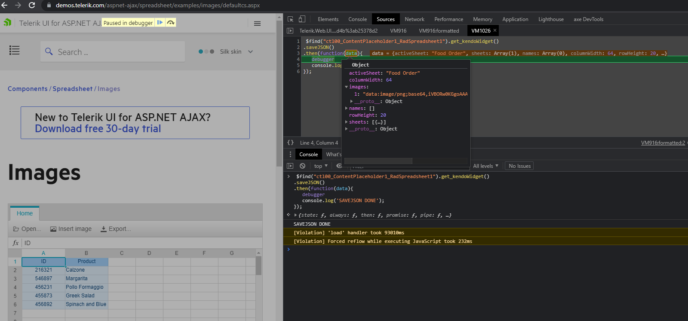

## Description

How to serialize the workbook with embedded images?

## Solution

The commonly used method for serialization [toJSON()](https://docs.telerik.com/kendo-ui/api/javascript/ui/spreadsheet/methods/tojson) is unable to serialize embedded images. To properly save images you need to use [saveJSON()](https://docs.telerik.com/kendo-ui/api/javascript/ui/spreadsheet/methods/savejson), which is asynchronous (returns a Promise).

You can test the saveJSON() method directly in our [live demo](https://demos.telerik.com/aspnet-ajax/spreadsheet/examples/images/defaultcs.aspx) by using the DevTools:

````JavaScript
$telerik.findControl(document,"RadSpreadsheet1").get_kendoWidget()
.saveJSON()
.then(function(data){ 
   debugger
   console.log('SAVEJSON DONE');               
});
````



## See Also

- [Spreadsheet Images demo](https://demos.telerik.com/aspnet-ajax/spreadsheet/examples/images/defaultcs.aspx)

- [saveJSON()](https://docs.telerik.com/kendo-ui/api/javascript/ui/spreadsheet/methods/savejson)

- [toJSON()](https://docs.telerik.com/kendo-ui/api/javascript/ui/spreadsheet/methods/tojson)

