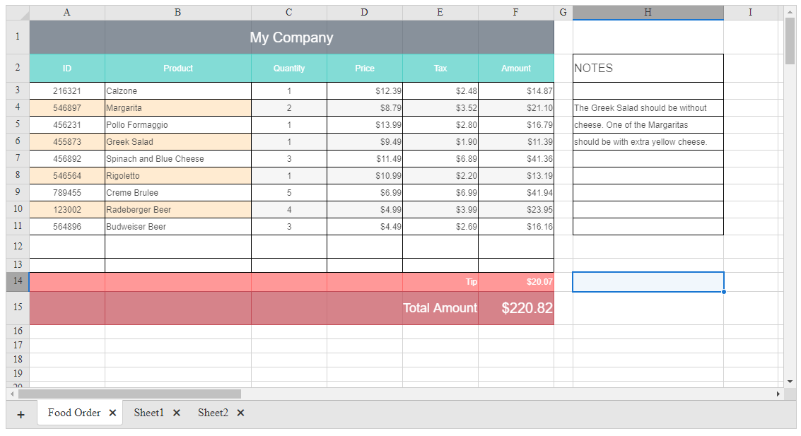

## How to

Create a read-only Spreadsheet loaded from Excel file.



## Solution

The solution is to subscribe to the[render event](https://docs.telerik.com/kendo-ui/api/javascript/ui/spreadsheet/events/render) of the underlying Kendo UI Spreadsheet and then disable all cells across all sheets.

Also, the Performance optimization approach can be applied from the[Improve performance of slowly loading Spreadsheet](https://www.telerik.com/support/kb/aspnet-ajax/spreadsheet/details/improve-performance-of-slowly-loading-spreadsheet) code library project.


````ASPX
<asp:HiddenField runat="server" ID="HiddenField1" />
<telerik:RadSpreadsheet runat="server" ID="RadSpreadsheet1"></telerik:RadSpreadsheet>
````

````JavaScript
function pageLoadHandler() {
    var spreadsheet = $find("<%= RadSpreadsheet1.ClientID %>");
    var value = $get("<%= HiddenField1.ClientID %>").value;
    var valueAsJSON = JSON.parse(value);

    spreadsheet.get_kendoWidget().fromJSON(valueAsJSON);
}

Sys.Application.add_load(pageLoadHandler);
````

````C#
protected void Page_Init(object sender, EventArgs e)
{
    var workbook = new Telerik.Web.Spreadsheet.Workbook();
 
    PopulateSheet(workbook.AddSheet(), "Workbook 1", 1598, 94);
    PopulateSheet(workbook.AddSheet(), "Workbook 2", 19627, 28);
    PopulateSheet(workbook.AddSheet(), "Workbook 3", 13325, 10);
    PopulateSheet(workbook.AddSheet(), "Workbook 4", 170, 26);
    PopulateSheet(workbook.AddSheet(), "Workbook 5", 44, 40);
    PopulateSheet(workbook.AddSheet(), "Workbook 6", 312, 23);
    PopulateSheet(workbook.AddSheet(), "Workbook 7", 297, 9);
 
    var json = workbook.ToJson();
    HiddenField1.Value = json;
}
 
private static void PopulateSheet(Worksheet sheet, string sheetName, int rowsCount, int columnsCount)
{
    sheet.Name = sheetName;
    sheet.Columns = new List<Column>();
 
    var row = new Row() { Index = 0 };
 
    // columns
    int columnIndex = 0;
    for (int i = 0; i < columnsCount; i++)
    {
        sheet.Columns.Add(new Column());
        string cellValue = "header" + i;
        var cell = new Cell() { Index = columnIndex++, Value = cellValue, Background = "#bfbfbf", Bold = true };
        row.AddCell(cell);
    }
    sheet.AddRow(row);
 
    // rows
    int rowIndex = 1;
    for (int r = 0; r < rowsCount; r++)
    {
        row = new Row() { Index = rowIndex++ };
        columnIndex = 0;
        for (int c = 0; c < columnsCount; c++)
        {
            string cellValue = "Row" + r + "; Col:" + c;
            var cell = new Cell() { Index = columnIndex++, Value = cellValue };
 
            row.AddCell(cell);
        }
 
        sheet.AddRow(row);
    }
}
````

 