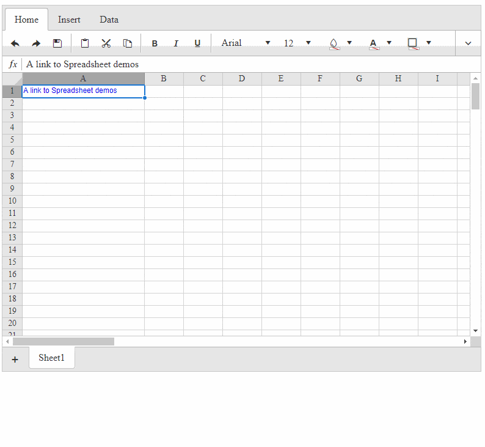

## How to

Open a link in Spreadsheet cell into a RadWindow.   


## Solution

To achieve that, subscribe to the click event of the &lt;a&gt; element inside the cells with class . k-spreadsheet-cell. In the event handler, you can get the href of the &lt;a&gt; element and pass it to the radopen() method which is available when you place a RadWindowManager on the page.

````ASPX
<telerik:RadWindowManager runat="server"></telerik:RadWindowManager>
<telerik:RadSpreadsheet runat="server" ID="RadSpreadsheet1"></telerik:RadSpreadsheet>
````

````JavaScript
function spreadsheetLoaded() {
    spreadsheet = $find("<%= RadSpreadsheet1.ClientID %>");
    // using .on(event, selector, handler) http://api.jquery.com/on/
    $telerik.$(spreadsheet.get_element()).on('click', '.k-spreadsheet-cell a', function (ev) {
        ev.preventDefault();
        var linkElement = this;
        //https://docs.telerik.com/devtools/aspnet-ajax/controls/window/getting-started/opening-windows#using-radopen-and-getradwindowmanageropen
        radopen(linkElement.href, null, 800, 600)
    });

    // Sys.Application.remove_load(spreadsheetLoaded); 
}
// Sys.Application.load Event https://msdn.microsoft.com/en-us/library/bb383829.aspx
Sys.Application.add_load(spreadsheetLoaded);
````

````C#
protected void Page_Init(object sender, EventArgs e)
{
    var worksheet = new Telerik.Web.Spreadsheet.Worksheet();
    worksheet.Columns = new List<Telerik.Web.Spreadsheet.Column>() { new Telerik.Web.Spreadsheet.Column() { Width = 200 } };
    var row = new Telerik.Web.Spreadsheet.Row();
    var cell = new Telerik.Web.Spreadsheet.Cell();
    cell.Value = "A link to Spreadsheet demos";
    cell.Link = "https://demos.telerik.com/aspnet-ajax/spreadsheet/examples/overview/defaultcs.aspx";
 
    row.Cells = new List<Telerik.Web.Spreadsheet.Cell>() { cell };
    worksheet.AddRow(row);
    RadSpreadsheet1.Sheets.Add(worksheet);
}
````

 