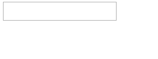

## How to
Implement the ShowPassword button for a RadTextBox with TextMode="Password".



## Solution

In the OnLoad client-side event of the TextBox we add the span element containing the "eye" to the TextBox element, hook the "keyup" event of the TextBox' input and hook the mousedown, mouseup and mouseout events of the "eye" element.

````ASPX
<telerik:RadTextBox runat="server" ID="RadTextBox1" TextMode="Password" >
    <ClientEvents OnLoad="OnLoad" />
</telerik:RadTextBox>
````

````CSS
.reveal-eye {
        position: relative;
        -webkit-user-select: none;
        -moz-user-select: none;
        -ms-user-select: none;
        user-select: none;
        position: absolute;
        right: 1px;
        top: 1px;
        bottom: 1px;
        z-index: 2;
        width: 30px;
        background: #fff url(https://dtzbdy9anri2p.cloudfront.net/cache/b55f544d09a0872a74b4427ce1fe18dd78418396/telerik/img/dist/reveal-password.png) 50% 50% no-repeat;
        cursor: pointer;
        visibility: hidden;
        opacity: 0;
        transition: opacity .2s ease 0s,visibility 0s linear .2s;
    }
 
        .reveal-eye.is-visible {
            display: block;
            visibility: visible;
            opacity: 1;
            transition: opacity .2s ease 0s,visibility 0s linear 0s;
        }
````

````JavaScript
function checkShowPasswordVisibility() {
        var $revealEye = $telerik.$(this).parent().find(".reveal-eye");
        if (this.value) {
            $revealEye.addClass("is-visible");
        } else {
            $revealEye.removeClass("is-visible");
        }
    }
    function OnLoad(sender, args) {
        var $revealEye = $telerik.$('<span class="reveal-eye"></span>')
         
        $telerik.$(sender.get_element()).parent().append($revealEye);
        $telerik.$(sender.get_element()).on("keyup", checkShowPasswordVisibility)
 
        $revealEye.on({
            mousedown: function () { sender.get_element().setAttribute("type", "text") },
            mouseup: function () { sender.get_element().setAttribute("type", "password") },
            mouseout: function () { sender.get_element().setAttribute("type", "password") }
        });
    }
````

 