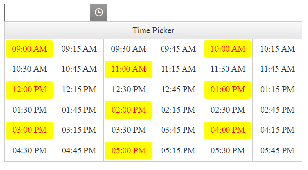
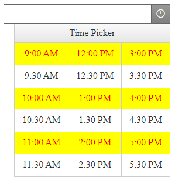

## Description

How to highlight the rounded hours in RadTimePicker?

## Solution

### Using Templates

By leveraging the TimeTemplate exposed in the RadTimeView embedded in the RadTimePicker we can have full control over the rendering of the separate time elements. Check out [RadTimeView Templates]().

With the following code we can add a custom CSS class to the items holding rounded hours (zero minutes) and style them with some additional CSS rules:

````ASPX
<telerik:RadTimePicker RenderMode="Lightweight" ID="RadTimePicker2" runat="server">
    <TimeView ID="TimeView1" runat="server" Interval="15" Columns="6">
        <HeaderTemplate>
            <div class="headerTemplate">
                Time Picker
            </div>
        </HeaderTemplate>
        <TimeTemplate>
            <a href="#" class="itemt <%# DateTime.Parse(DataBinder.Eval(Container, "DataItem.Time").ToString()).Minute == 0 ? "roundHour" : "" %>">
                <%# DataBinder.Eval(Container, "DataItem.Time", "{0:hh:mm tt}") %>
            </a>
        </TimeTemplate>
        <AlternatingTimeTemplate>
                <a href="#" class="itemt <%# DateTime.Parse(DataBinder.Eval(Container, "DataItem.Time").ToString()).Minute == 0 ? "roundHour" : "" %>">
                <%# DataBinder.Eval(Container, "DataItem.Time", "{0:hh:mm tt}") %>
            </a>
        </AlternatingTimeTemplate>
    </TimeView>
</telerik:RadTimePicker>
````

Sample CSS for highlighting

````CSS
.RadCalendarPopup .RadCalendarTimeView tr .roundHour {
    background-color: yellow;
    color: red;
}
````

Тhe result from the code above:



### Using CSS only

A more simple and easy to use approach is with using CSS only.

Note that this approach covers a special case (pretty common case actually) and it requires specific arrangement of the Time Grid in the RadTimeView: All the rounded hours should be aligned in rows so we can highlight the rows themselves.

Here is a sample usage: 

````ASPX
<style>
    .RadCalendarPopup .RadCalendarTimeView tr:nth-of-type(2),
    .RadCalendarPopup .RadCalendarTimeView tr:nth-of-type(5),
    .RadCalendarPopup .RadCalendarTimeView tr:nth-of-type(8) {
        background-color: yellow;
        color: red;
    }
</style>
<telerik:RadTimePicker RenderMode="Lightweight" ID="RadTimePicker1" Width="285px" runat="server" Visible="true">
    <TimeView Interval="20" Columns="4" RenderDirection="Vertical" StartTime="9:00" EndTime="18:15">
    </TimeView>
</telerik:RadTimePicker>
````

The result:



In case you are not familiar with the `nth-of-type()` selector used above, you may find it useful to check out the [CSS Selector Reference](https://www.w3schools.com/cssref/css_selectors.asp)

Some of the best practices and useful tips for fine-tuning the CSS of the elements on your web page you can find in the [Improve Your Debugging Skills with Chrome DevTools](https://www.telerik.com/blogs/improve-your-debugging-skills-with-chrome-devtools#see-the-applied-styles) blog post.


