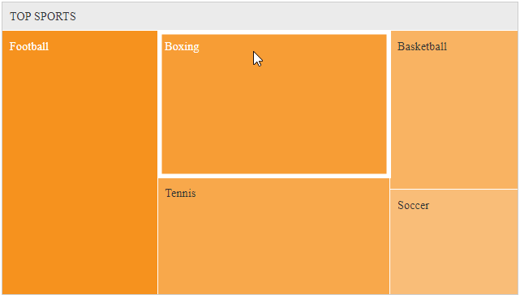

## Environment
<table>
	<tbody>
		<tr>
			<td>Product</td>
			<td>RadTreeMap for ASP.NET AJAX</td>
		</tr>
	</tbody>
</table>


## Description
In this article we are demonstrating a possible way to achieve drill-down functionality with RadTreeMap, utilizing the API of the control and the RadAjaxManager functionality. You can implement that by following the steps below:
1. Handle the client-side `Load` event of the TreeMap and attach a handler to the tile's element `click` event there.
1. Initialize a manual ajax request by pass the text of the clicked item to the AjaxManager (use the `ajaxRequest()` method)
1. Handle the AjaxManager's OnAjaxRequest event
1. Change the DataSource of the TreeMap depending on the argument passed to the server-side `AjaxRequest` Handler.

## Solution



````ASP.NET
        <telerik:RadCodeBlock runat="server">
            <script>
                var $ = $ || $telerik.$;
                var treeMap;

                function attachClickhandler(sender, args) {
                    treeMap = sender;

                    $(treeMap.get_element()).on("click", ".k-treemap-tile .k-leaf", function (e) {
                        e.stopPropagation();
                        var ajaxManager = $find("<%=RadAjaxManager1.ClientID%>");
                        var kendoWidget = treeMap.get_kendoWidget();
                        var tile = $(this);
                        var uid = tile.data().uid;

                        var tileObj = kendoWidget._getByUid(uid);
                        var dataItem = tileObj.dataItem;

                        if (kendoWidget._root.text == "TOP SPORTS") {
                            ajaxManager.ajaxRequest(dataItem.text);
                        }
                    });
                }
            </script>
        </telerik:RadCodeBlock>

        <telerik:RadAjaxManager ID="RadAjaxManager1" runat="server" OnAjaxRequest="RadAjaxManager1_AjaxRequest">
            <AjaxSettings>
                <telerik:AjaxSetting AjaxControlID="RadAjaxManager1">
                    <UpdatedControls>
                        <telerik:AjaxUpdatedControl ControlID="RadTreeMap1" LoadingPanelID="LoadingPanel1"></telerik:AjaxUpdatedControl>
                    </UpdatedControls>
                </telerik:AjaxSetting>
            </AjaxSettings>
        </telerik:RadAjaxManager>
        <telerik:RadAjaxLoadingPanel ID="LoadingPanel1" Height="77px" Width="113px" runat="server">
        </telerik:RadAjaxLoadingPanel>

        <telerik:RadTreeMap RenderMode="Lightweight" runat="server" ID="RadTreeMap1"
            OnClientLoad="attachClickhandler">
        </telerik:RadTreeMap>
````

````C#
    protected void Page_Load(object sender, EventArgs e)
    {
        if (!IsPostBack)
        {
            RadTreeMap1.DataFieldID = "ID";
            RadTreeMap1.DataFieldParentID = "ParentID";
            RadTreeMap1.DataTextField = "Sport";
            RadTreeMap1.DataValueField = "ID";
            RadTreeMap1.DataSource = GetSports();
            RadTreeMap1.DataBind();
        }
    }

    protected void RadAjaxManager1_AjaxRequest(object sender, Telerik.Web.UI.AjaxRequestEventArgs e)
    {
        string sport = e.Argument;
        RadTreeMap1.DataFieldID = "ID";
        RadTreeMap1.DataFieldParentID = "ParentID";
        RadTreeMap1.DataTextField = "Name";
        RadTreeMap1.DataValueField = "ID";
        DataTable result = GetPlayers().Select(string.Format("Sport = '{0}'", sport)).CopyToDataTable();

        RadTreeMap1.DataSource = result;
        RadTreeMap1.DataBind();
    }

    public static DataTable GetSports()
    {
        DataTable table = new DataTable();
        table.Columns.Add("ID");
        table.Columns.Add("ParentID");
        table.Columns.Add("Sport");

        table.Rows.Add(1, null, "TOP SPORTS");
        table.Rows.Add(2, 1, "Soccer");
        table.Rows.Add(3, 1, "Basketball");
        table.Rows.Add(4, 1, "Tennis");
        table.Rows.Add(5, 1, "Boxing");
        table.Rows.Add(6, 1, "Football");

        return table;
    }

    public static DataTable GetPlayers()
    {
        DataTable table = new DataTable();
        table.Columns.Add("ID");
        table.Columns.Add("ParentID");
        table.Columns.Add("Sport");
        table.Columns.Add("Name");

        table.Rows.Add(1, null, "Soccer", "Soccer");
        table.Rows.Add(2, 1, "Soccer", "Cristiano Ronaldo");
        table.Rows.Add(3, 1, "Soccer", "Lionel Messi");

        table.Rows.Add(4, null, "Basketball", "Basketball");
        table.Rows.Add(5, 4, "Basketball", "LeBron James");
        table.Rows.Add(6, 4, "Basketball", "Kobe Bryant");

        table.Rows.Add(7, null, "Tennis", "Tennis");
        table.Rows.Add(8, 7, "Tennis", "Roger Federer");
        table.Rows.Add(9, 7, "Tennis", "Rafael Nadal");

        table.Rows.Add(10, null, "Boxing", "Boxing");
        table.Rows.Add(11, 10, "Boxing", "Floyd Mayweather");
        table.Rows.Add(12, 10, "Boxing", "Manny Pacquiao");

        table.Rows.Add(13, null, "Football", "Football");
        table.Rows.Add(14, 13, "Football", "Matt Ryan");
        table.Rows.Add(15, 13, "Football", "Matthew Stafford");

        return table;
    }
````
````VB
    Protected Sub Page_Load(ByVal sender As Object, ByVal e As EventArgs) Handles Me.Load
        If Not IsPostBack Then
            RadTreeMap1.DataFieldID = "ID"
            RadTreeMap1.DataFieldParentID = "ParentID"
            RadTreeMap1.DataTextField = "Sport"
            RadTreeMap1.DataValueField = "ID"
            RadTreeMap1.DataSource = GetSports()
            RadTreeMap1.DataBind()
        End If
    End Sub

    Public Sub RadAjaxManager1_AjaxRequest(ByVal sender As Object, ByVal e As Telerik.Web.UI.AjaxRequestEventArgs) Handles RadAjaxManager1.AjaxRequest
        Dim sport As String = e.Argument
        RadTreeMap1.DataFieldID = "ID"
        RadTreeMap1.DataFieldParentID = "ParentID"
        RadTreeMap1.DataTextField = "Name"
        RadTreeMap1.DataValueField = "ID"
        Dim result As DataTable = GetPlayers().[Select](String.Format("Sport = '{0}'", sport)).CopyToDataTable()
        RadTreeMap1.DataSource = result
        RadTreeMap1.DataBind()
    End Sub

    Public Shared Function GetSports() As DataTable
        Dim table As DataTable = New DataTable()
        table.Columns.Add("ID")
        table.Columns.Add("ParentID")
        table.Columns.Add("Sport")
        table.Rows.Add(1, Nothing, "TOP SPORTS")
        table.Rows.Add(2, 1, "Soccer")
        table.Rows.Add(3, 1, "Basketball")
        table.Rows.Add(4, 1, "Tennis")
        table.Rows.Add(5, 1, "Boxing")
        table.Rows.Add(6, 1, "Football")
        Return table
    End Function

    Public Shared Function GetPlayers() As DataTable
        Dim table As DataTable = New DataTable()
        table.Columns.Add("ID")
        table.Columns.Add("ParentID")
        table.Columns.Add("Sport")
        table.Columns.Add("Name")
        table.Rows.Add(1, Nothing, "Soccer", "Soccer")
        table.Rows.Add(2, 1, "Soccer", "Cristiano Ronaldo")
        table.Rows.Add(3, 1, "Soccer", "Lionel Messi")
        table.Rows.Add(4, Nothing, "Basketball", "Basketball")
        table.Rows.Add(5, 4, "Basketball", "LeBron James")
        table.Rows.Add(6, 4, "Basketball", "Kobe Bryant")
        table.Rows.Add(7, Nothing, "Tennis", "Tennis")
        table.Rows.Add(8, 7, "Tennis", "Roger Federer")
        table.Rows.Add(9, 7, "Tennis", "Rafael Nadal")
        table.Rows.Add(10, Nothing, "Boxing", "Boxing")
        table.Rows.Add(11, 10, "Boxing", "Floyd Mayweather")
        table.Rows.Add(12, 10, "Boxing", "Manny Pacquiao")
        table.Rows.Add(13, Nothing, "Football", "Football")
        table.Rows.Add(14, 13, "Football", "Matt Ryan")
        table.Rows.Add(15, 13, "Football", "Matthew Stafford")
        Return table
    End Function
````

## See Also
* [RadTreeMap - Server-side Binding](https://docs.telerik.com/devtools/aspnet-ajax/controls/treemap/data-binding/server-side-binding)
* [RadAjaxManager - Manually Add an AJAX Request](https://docs.telerik.com/devtools/aspnet-ajax/controls/ajaxmanager/how-to/manually-add-an-ajax-request)


