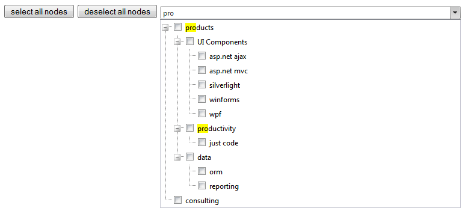

  
## How to
   

Manage *Search*, *Select All* and *Deselect All* functionality for RadTreeView in RadComboBox.   
   
   
   
## Description 

- *Search*: user can type in any keyword so the the TreeView nodes inside the Combo Box which contain this keyword will be highlighted.

- *Select All*: All checkboxes of TreeView nodes inside the Combo Box will be checked.

- *Deselect All*:  All checkboxes of TreeView nodes inside the Combo Box will be unchecked.

  

## Solution

RadTreeView with CheckBoxes is embedded in RadComboBox. This is achieved by using an ItemTemplate in the ComboBox:  
   
````ASPX
<telerik:RadComboBox "true" CloseDropDownOnBlur="false"OnClientKeyPressing="OnClientKeyPressing" Height="100%" runat="server">
 
        <Items>
            <telerik:RadComboBoxItem runat="server" Value="RadComboBoxItem1" />
        </Items>
        <ItemTemplate>
            <div id="div1">
                <telerik:RadTreeView ID="RadTreeView1" CheckBoxes="True" runat="server" TriStateCheckBoxes="false"
                    Skin="Telerik">
                    <Nodes>
                        <telerik:RadTreeNode runat="server" Expanded="true" Text="products">
                            <Nodes>
                                <telerik:RadTreeNode runat="server" Expanded="true" Text="UI Components">
                                    <Nodes>
                                        <telerik:RadTreeNode runat="server" Text="asp.net ajax">
                                        </telerik:RadTreeNode>
                                        <telerik:RadTreeNode runat="server" Text="asp.net mvc">
                                        </telerik:RadTreeNode>
                                        <telerik:RadTreeNode runat="server" Text="silverlight">
                                        </telerik:RadTreeNode>
                                        <telerik:RadTreeNode runat="server" Text="winforms">
                                        </telerik:RadTreeNode>
                                        <telerik:RadTreeNode runat="server" Text="wpf">
                                        </telerik:RadTreeNode>
                                    </Nodes>
                                </telerik:RadTreeNode>
                                <telerik:RadTreeNode runat="server" Expanded="true" Text="productivity">
                                    <Nodes>
                                        <telerik:RadTreeNode runat="server" Text="just code">
                                        </telerik:RadTreeNode>
                                    </Nodes>
                                </telerik:RadTreeNode>
                                <telerik:RadTreeNode runat="server" Text="data" Expanded="true">
                                    <Nodes>
                                        <telerik:RadTreeNode runat="server" Text="orm">
                                        </telerik:RadTreeNode>
                                        <telerik:RadTreeNode runat="server" Text="reporting">
                                        </telerik:RadTreeNode>
                                    </Nodes>
                                </telerik:RadTreeNode>
                            </Nodes>
                        </telerik:RadTreeNode>
                        <telerik:RadTreeNode runat="server" Expanded="true" Text="consulting">
                        </telerik:RadTreeNode>
                    </Nodes>
                </telerik:RadTreeView>
            </div>
        </ItemTemplate>
    </telerik:RadComboBox>
````

1. "*Search*": To achieve the highlighting of a node by typed keyword, **jQuery** is used after subscribing to the **OnClientKeyPressing** event of the RadComboBox: 

 ````JavaScript
function OnClientKeyPressing(sender, eventArgs) {
            setTimeout(function() {
                var enteredText = sender.get_text();
                $telerik.$('.RadComboBoxDropDown span').removeHighlight();
                if (enteredText != '')
                    $telerik.$('.RadComboBoxDropDown span').highlight(enteredText);
            }, 1000);
        } 
 ````

 Two functions are used. **hightlight(enteredText)** will mark all of the nodes which contain the typed keyword:  
   
 
   
 **removeHighlight()** function will return the text of the nodes to a normal state e.g. none is highlighed:  
   
 ````jQyery
$telerik.$.fn.removeHighlight = function() {
            return this.find("span.highlight").each(function() {
                this.parentNode.firstChild.nodeName;
                with (this.parentNode) {
                    replaceChild(this.firstChild, this);
                    normalize();
                }
            }).end();
        };
 ````
 
2. To achieve the "*Select All*" functionality an input field is added. Simple javascript function realized in the OnClick handler of the input field do the check of all nodes:  

 ````JavaScript
function selectAllNodes() {
            var combobox = $find('<%=RadComboBox1.ClientID %>');
            var nestedTreeView = combobox.get_items().getItem(0).findControl("RadTreeView1");
            for (var i = 0; i < nestedTreeView.get_allNodes().length; i++) {
                nestedTreeView.get_allNodes()[i].check();
            }
        }
 ````

3. "*Deselect All*": Analogically to the "*Select All*" , another input field is added. The whole RadTreeView is looped and each checkbox is unchecked: 

 ````JavaScript
function deselectAllNodes() {
           var combobox = $find('<%=RadComboBox1.ClientID %>');
           var nestedTreeView = combobox.get_items().getItem(0).findControl("RadTreeView1");
           for (var i = 0; i < nestedTreeView.get_allNodes().length; i++) {
               nestedTreeView.get_allNodes()[i].uncheck();
           }
       }
 ````

 