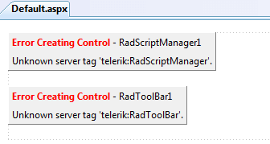
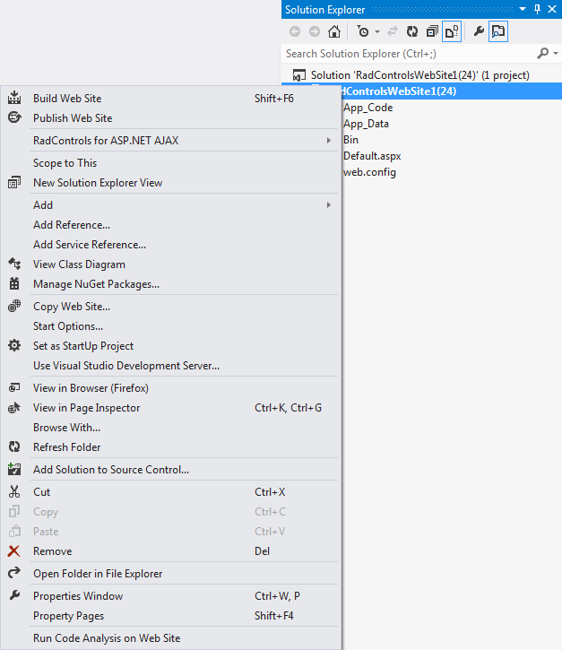
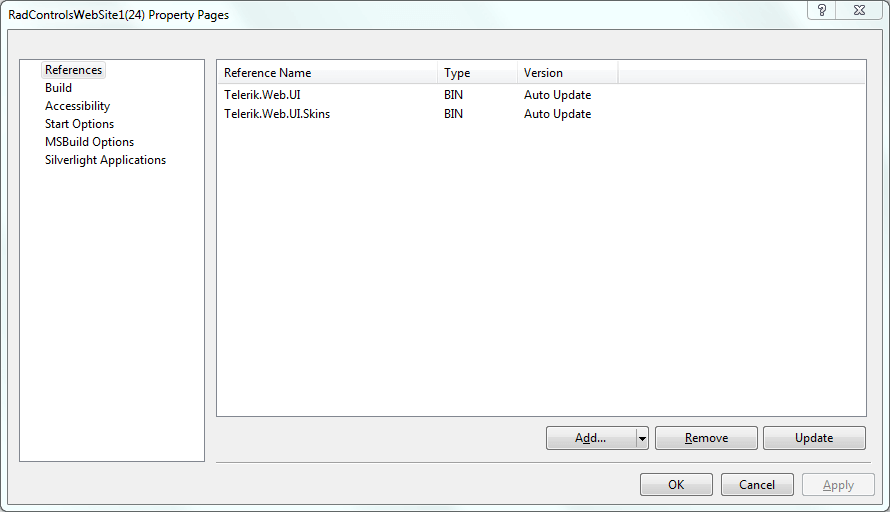
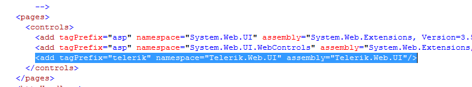
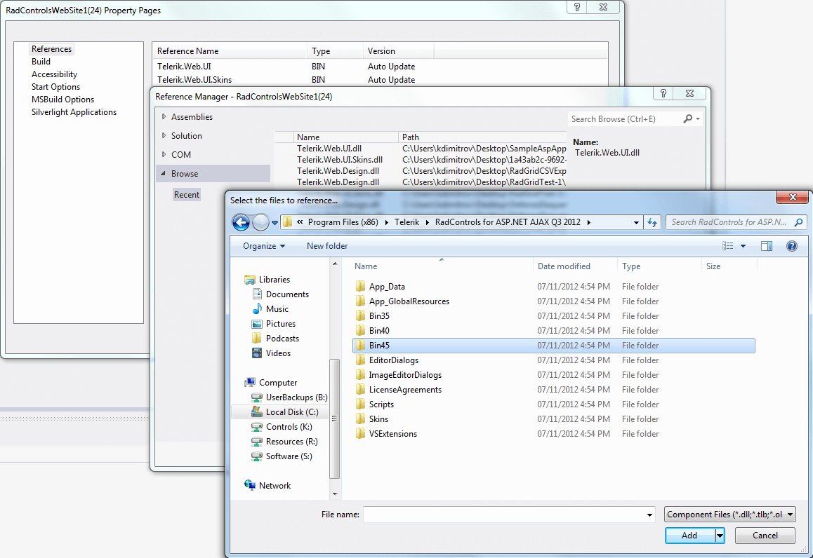

## Environment

<table>
	<tbody>
		<tr>
			<td>Product</td>
			<td>Progress® Telerik® UI for ASP.NET AJAX</td>
		</tr>
	</tbody>
</table>

## Description

When a project using Telerik controls is opened and a page is loaded, a `"Unknown Server Tag" or "Could not load file or assembly 'Telerik.Web.UI, version='XXXXX'..."` error occurs.

## Error Message

## Cause

Such errors usually occur when the project does not contain a reference to the `Telerik.Web.UI` assembly, or the reference is broken.

The possible causes for the errors are the following:

* There is a GAC-reference for the `Telerik.Web.UI` assembly in the project and the GAC has been updated, that is, an old `Telerik.Web.UI` assembly is deleted and a new one is added to the GAC. As a result, the `Telerik.Web.UI` assembly referenced by the website does not exist in the GAC.

* There is a `Bin` reference for the `Telerik.Web.UI` assembly in the project, which has been deleted for some reason. As a result, Visual Studio cannot find the `Telerik.Web.UI` assembly.

* The reference to the `Telerik.Web.UI` assembly, either in the `Register` directive or in the `web.config` file, or in the Telerik HTTP handlers or modules registrations in `web.config`, contains a hard-coded version number which does not match the version of the Telerik assembly referenced in your project.

## Solution

To solve this issue, use the respective approach:

* Update the reference to the `Telerik.Web.UI` assembly in your project.

* Update the GAC reference:

	* (Manually) Edit the `web.config` and/or the `ASPX/ASCX/Master/UserControl` files to reflect the assembly version change. You can also skip to specify the exact assembly version to prevent future conflicts.

	* (Automatically) Use the **Property** pages. You will still need to update the `<%@ Register Assembly="Telerik.Web.UI"… %>` directives in your pages manually.

		

		

		Note that to avoid the need to manually modify the `<%@ Register Assembly="Telerik.Web.UI"… %>` directives, it is recommended that you register the tag prefix in the `web.config` instead, as shown in the screenshot below.

		

* Update the `Bin` reference:

	1. Browse to the `Telerik.Web.UI` assembly through the **Property** pages. Make sure to choose the assembly from the correct folder (e.g. `bin35`, `bin40` or `bin45`) depening on the .NET version of your project.

		

		Note that when browsing to the `Telerik.Web.UI` assembly in the context of a website project, Visual Studio will always add a GAC reference if it finds the same version of the `Telerik.Web.UI` assembly.

	1. Use the **Convert To Telerik** project menu item available under the **Telerik** > **Telerik® UI for ASP.NET AJAX** menu in Visual Studio, which is available when the Visual Studio Extensions feature has been selected during the Telerik UI for ASP.NET AJAX installation.
