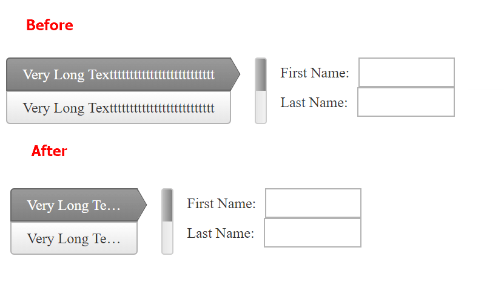

## Environment
<table>
	<tbody>
		<tr>
			<td>Product</td>
			<td>RadWizard for ASP.NET AJAX</td>
		</tr>
	</tbody>
</table>


## Description
In scenarios where the page space is limited you might need to reduce the width of the left/right positioned navigation bar of RadWizard:




## Solution
You can do that via the **.rwzVertical .rwzBreadCrumb .rwzLI** CSS class:

````ASP.NET
<!DOCTYPE html>

<html xmlns="https://www.w3.org/1999/xhtml">
<head runat="server">
    <title></title>
    <style>
        .rwzVertical .rwzBreadCrumb .rwzLI
        {
            width: 140px !important;
            min-width: 100px !important;
        }
    </style>
</head>
<body>
    <form id="form1" runat="server">
        <asp:ScriptManager runat="server" />
        <telerik:RadWizard ID="RadWizard4" runat="server" Width="100%" NavigationBarPosition="Left" ProgressBarPosition="Left" >
            <WizardSteps>
                <telerik:RadWizardStep Title="Very Long Textttttttttttttttttttttttttt">
                    <telerik:RadTextBox ID="RadTextBox3" Label="First Name: " runat="server"></telerik:RadTextBox>
                    <br />
                    <telerik:RadTextBox ID="RadTextBox4" Label="Last Name: " runat="server"></telerik:RadTextBox>
                </telerik:RadWizardStep>
                <telerik:RadWizardStep Title="Very Long Textttttttttttttttttttttttttt">
                </telerik:RadWizardStep>
            </WizardSteps>
        </telerik:RadWizard>
    </form>
</body>
</html>
````


