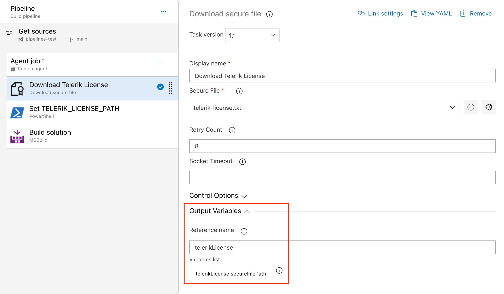
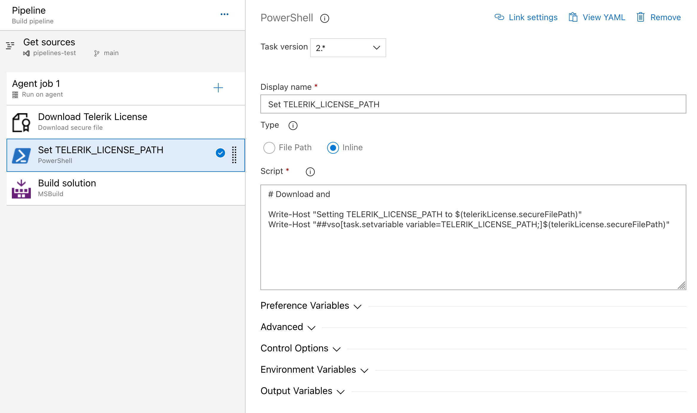

# Adding Your License Key to CI/CD Services

This article describes how to set up and activate your Telerik UI for ASP.NET AJAX license across a few popular CI/CD services by using deployment keys.

Deployment keys are a dedicated type of license key for build pipelines. They're tied to a specific application and the set of products that the application uses. Deployment keys cannot be used for application development.

To activate your license in a CI/CD environment:

1. Navigate to the [Deployment Keys](https://www.telerik.com/account/downloads/deployment-keys) page.
1. Click **Add Application**. In the form that opens:

    1. Add the application name.
    1. Select the type of application—public or private.
    1. Select the set of products used in the application.

1. Copy the key value and store it securely.
1. [Create an environment variable](#creating-an-environment-variable) named `TELERIK_LICENSE` and set it to the obtained key value. Alternatively, the key can be stored in a `telerik-license.txt` file, for example when using the [Azure Secure Files approach](#using-secure-files-on-azure-devops).

## ASP.NET Web Application Build Flow

Use the activation method that matches the project type and package setup:

| Project setup | CI activation | Production deployment |
|---|---|---|
| Web Application using the `Telerik.Licensing` NuGet package | Provide `TELERIK_LICENSE` or `TELERIK_LICENSE_PATH` before the package restore and build. | Do not deploy `telerik-license.txt`; the license is consumed during the build. |
| Web Application without NuGet | Generate the Script key source file from a protected CI secret, compile it with the application, and reference `Telerik.Licensing.Runtime.dll`. | Do not commit or publish the generated source file or the Script key. |
| Web Site | Generate the Script key file in `App_Code` during the build. | Deploy the generated `App_Code` file as required for Web Site projects. |

For a Web Application, keep license activation separate from package-feed authentication. `TELERIK_LICENSE` activates Telerik licensing; `TELERIK_NUGET_KEY` authenticates a private Telerik NuGet feed. Configure the feed credentials separately by following [NuGet Keys]().

The provider-neutral build order is:

1. Make the license secret available to the build process as `TELERIK_LICENSE`, or download a protected license file and set `TELERIK_LICENSE_PATH` to its path.
1. Restore the solution or project, including the `Telerik.Licensing` package when the Web Application uses NuGet.
1. Build the solution or project with the same configuration used for deployment.
1. Publish the application without copying `telerik-license.txt`, `TELERIK_LICENSE`, or generated Script key source files into the deployment artifact.
1. Remove downloaded or generated license material from the build workspace when the CI service does not clean it automatically.

For a Web Application without NuGet, use the [CI Script key procedure]() to generate the source file during the build. Do not place a real key in the pipeline definition, source control, or an example.

## Creating an Environment Variable

The recommended approach for providing your license key to the `Telerik.Licensing` NuGet package is to use environment variables. Each CI/CD platform has a different process for setting environment variables and this article lists only some of the most popular examples.

> If your CI/CD service is not listed in this article, don't hesitate to contact the Telerik technical support.

### GitHub Actions

1. Create a new [Repository Secret](https://docs.github.com/en/actions/reference/encrypted-secrets#creating-encrypted-secrets-for-a-repository) or an [Organization Secret](https://docs.github.com/en/actions/reference/encrypted-secrets#creating-encrypted-secrets-for-an-organization).
1. Set the name of the secret to `TELERIK_LICENSE` and paste the contents of the license file as a value.
1. Expose the secret to the restore and build steps. The following example uses a Windows runner for an ASP.NET Web Application; replace `path/to/solution.sln` with the path to your solution:

```YAML
name: Build ASP.NET Web Application

on:
    workflow_dispatch:

jobs:
    build:
        runs-on: windows-latest
        env:
            TELERIK_LICENSE: ${{ secrets.TELERIK_LICENSE }}
        steps:
            - uses: actions/checkout@v4
            - uses: microsoft/setup-msbuild@v2
            - name: Restore packages
                run: nuget restore path/to/solution.sln
            - name: Build
                run: msbuild path/to/solution.sln /p:Configuration=Release
```

The license secret is available only to the build steps in this example. Do not add it to the workflow file or copy `telerik-license.txt` to the published application.

### Azure Pipelines

1. Create a new [secret variable](https://learn.microsoft.com/en-us/azure/devops/pipelines/process/variables?view=azure-devops&tabs=yaml%2Cbatch#secret-variables) named `TELERIK_LICENSE`.
1. Paste the contents of the license key file as a value.

> Always consider the _Variable size limit_—if you are using a [Variable Group](https://learn.microsoft.com/en-us/azure/devops/pipelines/library/variable-groups?view=azure-devops&tabs=azure-pipelines-ui%2Cyaml), the license key will typically exceed the character limit for the variable values. The only way to have a long value in the Variable Group is to [link it from Azure Key Vault](https://learn.microsoft.com/en-us/azure/devops/pipelines/library/link-variable-groups-to-key-vaults?view=azure-devops). If you cannot use a Key Vault, then use a normal pipeline variable instead (see above) or use the [**Secure files** approach instead](#using-secure-files-on-azure-devops).

## Using Secure Files on Azure DevOps

[Secure files](https://learn.microsoft.com/en-us/azure/devops/pipelines/library/secure-files?view=azure-devops) are an alternative approach for sharing the license key file in Azure Pipelines that does not have the size limitations of environment variables.

You have two options for the file-based approach. Set the `TELERIK_LICENSE_PATH` variable or add a file named `telerik-license.txt` to the project directory or a parent directory.

> Make sure you're referencing Telerik.Licensing v1.4.10 or later.

#### YAML Pipeline

With a YAML pipeline, you can use the [**DownloadSecureFile@1**](https://learn.microsoft.com/en-us/azure/devops/pipelines/tasks/reference/download-secure-file-v1?view=azure-pipelines) task, then use `$(name.secureFilePath)` to reference it. For example:

```yaml
    - task: DownloadSecureFile@1
        name: DownloadTelerikLicenseFile
        displayName: 'Download Telerik License Key File'
        inputs:
            secureFile: 'telerik-license.txt'

    - task: MSBuild@1
        displayName: 'Build Project'
        inputs:
            solution: 'myapp.csproj'
            platform: Any CPU
            configuration: Release
            msbuildArguments: '/p:RestorePackages=false'
        env:
            TELERIK_LICENSE_PATH: $(DownloadTelerikLicenseFile.secureFilePath)
```

#### Classic Pipeline

With a classic pipeline, use the "Download secure file" task and a PowerShell script to set `TELERIK_LICENSE_PATH` to the `secureFilePath` property of the output variable.

1. Add a "Download secure file" task and set the output variable's name to `telerikLicense`.



1. Add a PowerShell task and set the `TELERIK_LICENSE_PATH` variable to the `secureFilePath` property of the output variable:



The script to set the environment variable is quoted below:

```powershell
Write-Host "Setting TELERIK_LICENSE_PATH to $(telerikLicense.secureFilePath)"
Write-Host "##vso[task.setvariable variable=TELERIK_LICENSE_PATH;]$(telerikLicense.secureFilePath)"
```

Alternatively, copy the file into the repository directory:

```powershell
echo "Copying $(telerikLicense.secureFilePath) to $(Build.Repository.LocalPath)/telerik-license.txt"
Copy-Item -Path $(telerikLicense.secureFilePath) -Destination "$(Build.Repository.LocalPath)/telerik-license.txt" -Force
```

## See Also

* [Setting Up Your License Key]()
* [License Activation Errors and Warnings]()
* [Frequently Asked Questions about Your Telerik UI for ASP.NET AJAX License Key]()