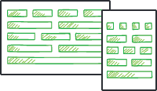
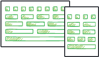
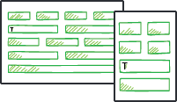

# Responsive Types of Behavior

The Telerik UI for ASP.NET AJAX controls deliver a set of responsive behaviors that enable you to integrate them into the web design and provide responsive, adaptive, elastic, and fluid capabilities. 

## Specifics

The following list defines the features of the responsive behaviors a control can acquire:

* Fluid controls&mdash;A fluid control can take up 100% of the width of its parent and resize with it in real-time as opposed to stretching initially and not responding to changes in the size of the container. Fluid controls fill in their containing object in the HTML layout. Most Telerik ASP.NET AJAX controls now feature fluid behaviors.

	>caption The fluid concept 	

	

	>caption Sample of fluid behavior
	
	
	

* Responsive controls&mdash;The responsive controls feature single HTML rendering and are adapted for various device and browser sizes in the browser through styles and scripts. The whole script and style information is transmitted to the browser, and with CSS media queries the browser presents the optimized layout for the control. A responsive control will have the same HTML rendering in all resolutions, but CSS rules or JavaScript logic may reorder, resize, or even hide certain elements from its UI to make it more suitable for the current dimensions. For more information, refer to the [responsive control demos online](https://demos.telerik.com/responsive-web-design-aspnet/samples/responsive-behavior.aspx).

	>caption The responsive concept 

	


	>caption Sample of responsive behavior

	
	

* Elastic controls&mdash;Elastic behavior means that the control will grow and shrink appropriately to maintain a size that is relative to the font-size in use on the web page. In this way, end users can zoom or change the font sizes in their browser, and allow the controls to size appropriately. This feature is usually achieved by using `em` units for font-size and padding settings. For more information, refer to the [elastic control demos online](https://demos.telerik.com/responsive-web-design-aspnet/samples/elastic-behavior.aspx).

	>caption The elastic concept

	

	>caption Sample of elastic behavior
	
	

	
* Adaptive controls&mdash;Adaptive controls feature multiple HTML renderings with the appropriate styles to support various devices. Usually, at least one mode is optimized for mobile devices. When a page that contains an adaptive control is requested, the control defines on the server which HTML rendering is optimal for the browser and for the device which request the content. For more information, refer to the [adaptive control demos online](https://demos.telerik.com/responsive-web-design-aspnet/samples/adaptive-behavior.aspx).

	>caption The adaptive concept

	

	>caption Sample of adaptive behavior 
	
	


For more information on the responsive control types, refer to the assembled sample implementations of all of these features on the	[responsive web design sample website](https://demos.telerik.com/responsive-web-design-aspnet/default.aspx). 

## CSS Selectors for Elastic Design

The following example demonstrates the selectors for all controls that support elastic design and how setting the default font size of the page can affect all Telerik controls in it.

@[template](/_templates/common/font-size-notes.md#note-and-example "control: each Telerik® UI for ASP.NET AJAX control")

The following example provides the CSS selectors that enable you to resize the supported UI elements through a font-size change and demonstrates the elastic design capabilities of the controls.

````CSS
/* AutoCompleteBox */ html .RadAutoCompleteBox, html .RadAutoCompleteBoxPopup,
/* Button */ html .RadButton,
/* Calendar */ html .RadCalendar,
/* ComboBox */ html .RadComboBox, html .RadComboBoxDropDown,
/* DataForm */ html .RadDataForm,
/* DataPager */ html .RadDataPager,
/* Dock */ html .RadDock,
/* DropDownList */ html .RadDropDownList, html .rddlPopup,
/* DropDownTree */ html .RadDropDownTree, html .rddtPopup,
/* Editor */ 	div.RadEditor,
				div.RadEditor .reToolbarWrapper,
				div.RadEditor .reToolBar
				 div.reDropDownBody
/* Filter */ html .RadFilter, html .RadMenu,
/* Gantt */ html .RadGantt,
/* ImageGallery */ html .RadImageGallery,
/* Input */ html .RadInput,
/* LightBox */ html .RadLightBox,
/* ListBox */ html .RadListBox,
/* Map */ html .RadMap,
/* MediaPlayer */ html .RadMediaPlayer,
/* Menu */ html .RadMenu,
/* Notification */ html .RadNotification,
/* PanelBar */ html .RadPanelBar,
/* PivotGrid */ html .RadPivotGrid,
				html .PivotGridWindow,
/* ProgressBar */ html .RadProgressBar,
/* Rating */ html .RadRating,
/* Rotator */ html .RadRotator,
/* SearchBox */ html .RadSearchBox, html .rsbPopup,
/* SiteMap */ html .RadSiteMap,
/* Slider */ html .RadSlider,
/* SocialShare */ html .RadSocialShare,
/* TagCloud */ .RadTagCloud,
/* Ticker */ body, /* or any other selector that will affect the ticker */
/* ToolTip */ html .RadToolTip,  
/* TreeMap */ html .RadTreeMap,
/* TreeList */ html .RadTreeList,
/* TreeView */ html .RadTreeView,
/* Window */ html .RadWindow {
	font-size: 24px;
}
````

The following example demonstrates the CSS selectors used for the `RadFormDecorator` elements and shows the elastic capabilities of the control. For more information, refer to the article on the [elastic capabilities in the FormDecorator]().


````CSS
/* FormDecorator */
html.RadForm .rfdSkinnedButton,
html.RadForm .rfdTextInput,
html.RadForm.rfdLabel label,
html.RadForm.rfdLabel .rfdAspLabel,
html.RadForm.rfdTextbox input,
html.RadForm.rfdTextarea textarea,
html.RadForm.rfdFieldset fieldset,
html.RadForm.rfdFieldset legend,
html.RadForm .rfdSelect,
html.RadForm.rfdHeading h4,
html.RadForm.rfdHeading h5,
html.RadForm.rfdHeading h6,
html.RadForm .riTextBox,
html.RadForm .rfdValidationSummaryControl,
html.RadForm .rfdLoginControl {
	font-size: 24px;
}

/* Headings */
html.RadForm.rfdHeading h4 {
	font-size: 40px;
}
html.RadForm.rfdHeading h5 {
	font-size: 35px;
}
html.RadForm.rfdHeading h6 {
	font-size: 30px;
}

/* ListBox Styles */
html.rfdSelectBox {
	font-size: 24px;
}

/* drop down arrow positions should be tweaked */
html.RadForm .rfdDropDownArrow
{
	right: 10px;
	top: 10px;
}

/* checkboxes and radio buttons' positions should be tweaked */
html.RadForm .rfdCheckboxChecked .rfdToggleImage,
html.RadForm .rfdCheckboxUnchecked .rfdToggleImage,
html.RadForm .rfdRadioChecked .rfdToggleImage,
html.RadForm .rfdRadioUnchecked .rfdToggleImage
{
	top: 10px;
}
````


## List of Controls with Responsive Behaviors 

The following table lists the responsive capabilities of the Telerik UI for ASP.NET AJAX controls.

| Control | Elastic | Fluid | Responsive | Adaptive |
| ------ | ------ | ------ | ------ | ------ |
|Ajax|N/A|N/A|N/A|N/A|
|AutoCompleteBox|Yes|Yes|N/A|N/A|
|Barcode|N/A|N/A|N/A|N/A|
|BinaryImage|N/A|N/A|N/A|N/A|
|Button|[Yes]()|[Yes]()|No|No|
|Calendar|[Yes]()|[Yes]()|No|No|
|Captcha|N/A|No|N/A|N/A|
|Chart (HTML5)|N/A|N/A (but [possible](https://demos.telerik.com/aspnet-ajax/htmlchart/examples/functionality/responsive-chart/defaultcs.aspx))|N/A (but [possible](https://demos.telerik.com/aspnet-ajax/htmlchart/examples/functionality/responsive-chart/defaultcs.aspx))|N/A|
|Chart|N/A|N/A|N/A|N/A
|CheckBox|[Yes]()|Yes|No|No||
|ColorPicker|[Yes]()|No|No|No|
|ComboBox|Yes|Yes|N/A|N/A|
|DataForm|[Yes]()|[Yes]()|No|No|
|DataPager|Yes|Yes|Yes|Yes|
|Diagram|N/A|N/A|N/A|N/A|
|Dock|[Yes]()|N/A|[Yes]()|N/A|
|DropDownList|Yes|Yes|N/A|N/A|
|DropDownTree|Yes|Yes|N/A|N/A|
|Editor|[Yes]()|[Yes]()|Yes|[Yes]()|
|FileExplorer|[Limited]()|Yes|No|No|
|Filter|Yes|No|No|No|
|FormDecorator|[Yes]()|[Yes]()|[Yes]()|N/A|
|Gantt|Yes|Yes|Yes|No|
|Gauge|N/A|N/A|N/A|N/A|
|Grid|No|Yes|No|[Yes]()|
|ImageButton|[Yes]()|[Yes]()|No|No|
|ImageEditor|[Yes]()|Yes|No|No|
|ImageGallery|Yes|Yes|Yes|Yes|
|Input|Yes|No|N/A|No|
|LightBox|Yes|Yes|No|Yes|
|LinkButton|[Yes]()|[Yes]()|No|No|
|ListBox|Yes|Yes|N/A|N/A|
|ListView|No|Yes|No|No|
|Map|[Yes]()|[Yes]()|N/A|N/A|
|MediaPlayer|Yes|Yes|No|Yes|
|Menu|Yes|Yes|Yes (custom CSS)|[Yes]()|
|Notification|[Yes]()|[Yes]()|[Yes]()|N/A|
|ODataDataSource|N/A|N/A|N/A|N/A|
|OrgChart|Yes|N/A|N/A|N/A|
|PanelBar|Yes|Yes|N/A|N/A|
|Persistence Framework|N/A|N/A|N/A|N/A|
|PivotGrid|[Yes]()|[Yes]()|No|No|
|Progress Area|Yes|Yes|No|No|
|Progress Bar|[Yes]()|[Yes]()|[Yes]()|No|
|PushButton|[Yes]()|[Yes]()|No|No|
|Rating|[Yes]()|No|No|N/A|
|RibbonBar|Yes|Yes|No|No|
|Rotator|[Yes]()|[Yes]()|No|N/A|
|Scheduler|No|Yes|N/A|[Yes]()|
|SearchBox|Yes|No|N/A|N/A|
|SiteMap|Yes|Yes|N/A|N/A|
|Slider|[Yes]()|[Yes]()|[Yes]()|N/A|
|SocialShare|[Yes]()|[Yes]()|No|No|
|Spell|No|No|No|No|
|Splitter|[Limited]()|[Yes]()|[Yes]()|N/A|
|TabStrip|Yes|Yes|N/A|N/A|
|TagCloud|[Yes]()|N/A|[Yes]()|N/A|
|Ticker|[Yes]()|Yes|No|N/A|
|Tile|[Yes]()|[Yes]()|N/A|N/A|
|TileList|[Yes]()|[Yes]()|[Yes]()|[Yes]()|
|ToolBar|Yes|Yes|Yes|N/A|
|ToolTip|[Yes]()|N/A|[Yes]()|N/A|
|ToggleButton|[Yes]()|[Yes]()|N/A|N/A|
|TreeMap|Yes|Yes|No|No|
|TreeList|Yes|Yes|No|No|
|TreeView|Yes|No|N/A|N/A|
|Upload (Async)|Yes|Yes|No|No|
|Upload (Cloud)|Yes|Yes|No|No|
|Window|[Yes]()|No|No|N/A|
|Wizard|Yes|Yes|Yes|[Yes]()|
|XmlHttpPanel|N/A|N/A|N/A|N/A|
|ZipLibrary|N/A|N/A|N/A|N/A|

# See also

@[template](/_templates/common/font-size-notes.md#related-resources)

