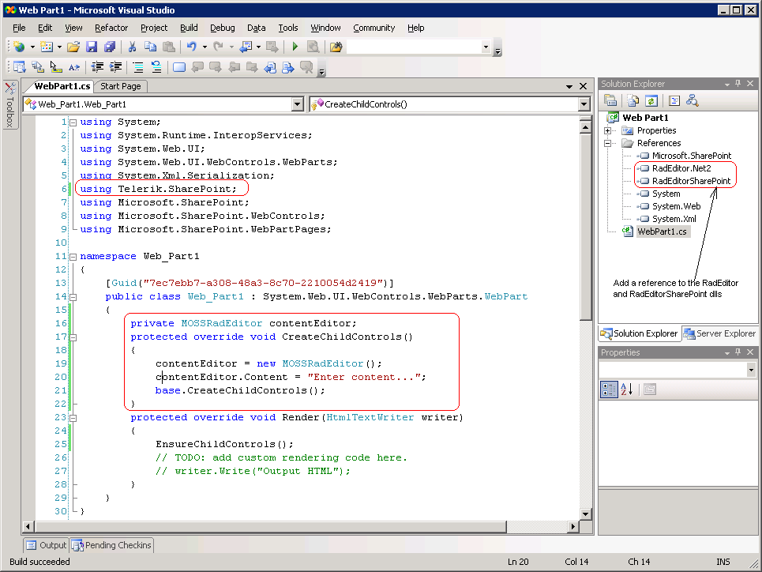

# Using RadEditor in custom MOSS solutions


## 

To use RadEditor in custom MOSS solutions, you can use the MOSSRadEditor base class.

````C#
	using System;
	using System.Runtime.InteropServices;
	using System.Web.UI;
	using System.Web.UI.WebControls.WebParts;
	using System.Xml.Serialization;
	using Telerik.SharePoint;
	using Microsoft.SharePoint;
	using Microsoft.SharePoint.WebControls;
	using Microsoft.SharePoint.WebPartPages;
	
	namespace Web_Part1
	{
		[Guid("7ec7ebb7-a308-48a3-8c70-2210054d2419")]
		public class Web_Part1 : System.Web.UI.WebControls.WebParts.WebPart
		{
			private MOSSRadEditor contentEditor;
			protected override void CreateChildControls()
			{
				contentEditor = new MOSSRadEditor();
				contentEditor.Content = "Enter content...";
				base.CreateChildControls();
			}
			protected override void Render(HtmlTextWriter writer)
			{
				EnsureChildControls();
				// TODO: add custom rendering code here.
				// writer.Write("Output HTML");
			}
		}
	}
````


It is important to add references to the __Telerik.Web.UI.dll__ and __RadEditorSharePoint.dll__ files. To do so, you need to follow these steps:

1. Open the RadEditor for MOSS distribution.

1. Rename __RadEditorMOSS.wsp__ to __RadEditorMOSS.cab__ and open the file with Windows Cabinet Viewer.

1. Copy __Telerik.Web.UI.dll and RadEditorSharePoint.dll__to a convenient place on your disk.

1. Add the references to the files in your MOSS project.


>caption 


