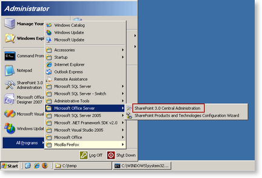
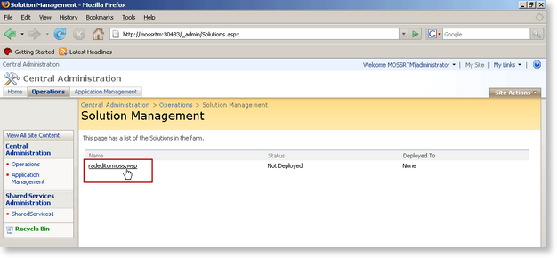
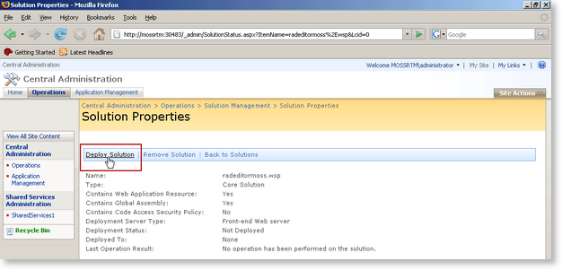
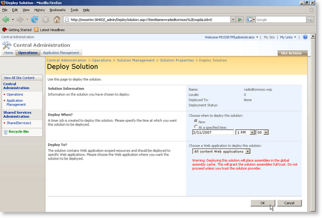

# Installing RadEditor in a MOSS 2007 farm

## 

Follow the steps below to install Telerik RadEditor for MOSS on your SharePoint 2007 farm.

1. Extend your MOSS site with [ASP.NET AJAX 1.0]() or [ASP.NET AJAX 3.5]()

2. Extract the contents of __RadEditorMOSS_5_x_x_Dev.zip__or (__RadEditorMOSS_5_x_x_Trial.zip____-__if you are using the trial version) to a folder of your choice on the MOSS server.

3. Open a command prompt window.

4. Run the __stsadm.exe__ utility to install __RadEditorMOSS__solution. By default __stsadm.exe__ can be found in __[Program Files]\Common Files\Microsoft Shared\web server extensions\12\BIN__.

Use the following syntax:

`stsadm -o addsolution -filename [Path]\RadEditorMOSS.wsp`
>caption 

5. Open the SharePoint __Central Administration__ page.
>caption 

6. Go to the __Operations__ page and click on __Solution Management__.
>caption 

7. You should see the __radeditormoss.wsp__ solution in the list. Click on the name link to go to the __Solution Properties__ page.
>caption 

8. Select __Deploy Solution__.
>caption 

9. From the next page you can choose when and to which applications to deploy the solution.
>caption 

10. After a successful deployment you will see the following screen:
>caption 

>note  __Note__ : If you see the following exception - "Request for permission of type..." when you try to open a page containing the editor, then you might need to modify the web.config of your SharePoint application and set the Trust level to at least Medium level. This can happen if you choose to deploy the editor solution to a single site (in the BIN folder) instead of to all sites (in the GAC).
>

