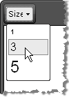

# Font Sizes


>caption 



## Adding Font Sizes

You can populate the __FontSizes__ dropdown by modifying the __ToolsFile.xml / ListToolsFile.xml__ files, located in the following folder:

/Program Files/Common Files/Microsoft Shared/web server extensions/wpresources/RadEditorSharePoint/6.x.x.0__1f131a624888eeed/Resources/

__For example:__

````XML
	    <root>  
	        <tools name="MainToolbar" enabled="true">    
	            <tool name="FontSize" />  
	        </tools>  
	        <fontSizes>    
	            <item>1</item>    
	            <item>3</item>    
	            <item>5</item>  
	         </fontSizes>
	    </root>
````


If you want to apply font sizes in pixels (px) or in points (pt) then use the [Real Font Size]() dropdown.
