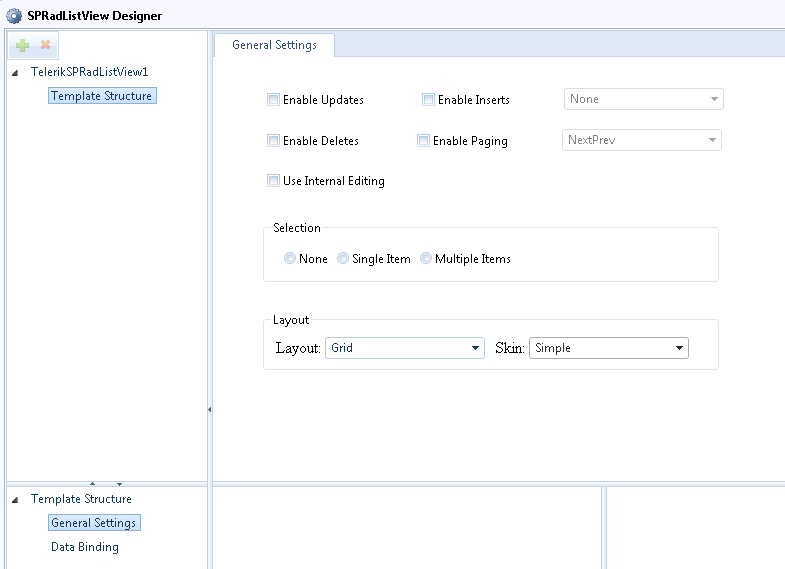
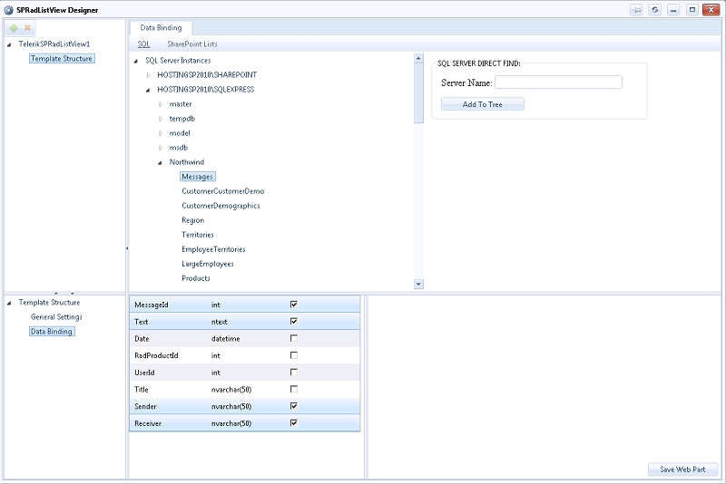
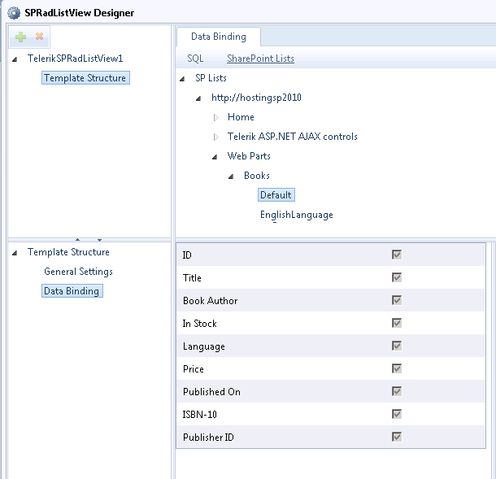

# Getting Started

## SPRadListView Designer

__TelerikSPRadListView Web Part__ features the Telerik RadListView control integrated into a dedicated SharePoint 2010 web part. It comes with the five predefined layouts already known from the RadListView's designer and allows for automatic insert/update/delete operations, item selection and paging.

TelerikSPRadListView supports binding both to SQL server database tables as well as SharePoint lists. Like its RadGrid counterpart TelerikSPRadListView comes outfit with a web part designer.To load the designer, go to the Web Part's menu and choose SPRadListView Designer:

The web part designer gives the opportunity to specify the most important properties for the list view controls, such as layout, skin, selection, automatic operations,insert item position and paging. In order to do so, select the TelerikSPRadListView1 or TemplateStructure nodefrom the upper left tree view and click the General Settings node in the lower left one:
>caption 

To indicate the data-source to which the list view control should be bound to, first select the TemplateStructure node from the upper left tree view and click on the DataBinding node in the bottom left designer pane. This will load the SQL and SP lists explorer into the top right pane:
>caption 

Since there is the possibility that due to network circumstances not all SQL Serverswill be loaded into the SQL Server Instances tree, you can hard code the name of the database server manually in the panel in the top left and add it to the tree:
>caption 

When an instance of an SQL server is chosen as the data source for the template structure of the list view, the user will be prompted to provide his/her credentials before being able to browse the server's databases and tables:

Upon having chosen an SQL table the designer will automatically load its columns into the bottom right panefor you to pick the ones to be displayed in the list view.	By analogy, you can work with the SharePoint Lists explorer.No columns are selected for the SP lists but instead the user is prompted to pick theSP View which the list view control should be bound to:

## SPRadListView ToolPart

The SPRadListView Designer does not preclude the use of the Web Part's Tool Part and it has been built as an additional option if you need to bind the list view control to just a single SharePoint list without opening the designer. In addition, the most important properties for the control can be set from the tool part:

Particular attention should be paid to the __Binding Mode__ property.The relevant Binding Mode options are respectively: SQL, SPList and Single SP List.You should choose SQL if you have previously bound the list view control to a SQL Server database table through theSPRadListView designer and now you need just to set some of its properties through the ToolPart.That means that the list view control will remain bound to the SQL table but its properties will change in accordance withthe settings in the tool part. The same goes for the SPList option the only difference being that in this case you should have the list view control previously bound to a SharePoint list. Single SP List should be chosen when you need not only to adjust the list view properties but also to bind the control to a single SharePoint list that you need to choose through the List settings combos.
