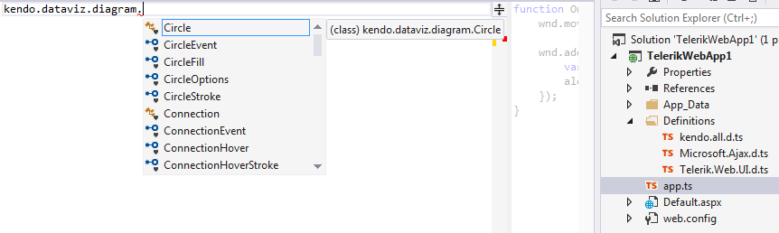

# Add TypeScript Definitions for Controls Using Kendo UI

This article explains how to add the __Kendo UI TypeScript definitions__ in order to	have full intellisense for controls from the UI for ASP.NET AJAX suite that use __Kendo UI__ widgets.

## Getting the Kendo TypeScript Definitions

If you have a license for the __Kendo UI__ distribution, you canfind the __kendo.all.d.ts__ file in the __typescript__ folder, inside the downloaded package.Otherwise, you can get the file by downloading the trial version—[Try Kendo UI](http://www.telerik.com/download/kendo-ui).

You can read more about the __Kendo TypeScript__ definitions in the [Kendo UI TypeScript Support](http://docs.telerik.com/kendo-ui/typescript) help article.

## Adding the Definitions to the Project

By following these steps you will have full intellisense for the exposed __Kendo__ widgets:

1. Make sure that the instructions from the [Add TypeScript Definitions for the Telerik UI for ASP.NET AJAX Suite]() article are followed and that the __Microsoft.Ajax.d.ts__ and __Telerik.Web.UI.d.ts__ are added properly;

1. Put the __kendo.all.d.ts__ file in the same folder—e.g., __Definitions__.
>caption 

You can learn how to get a reference to the	integrated Kendo widgets and use them in TypeScript code in the	[Use TypeScript for Controls Using Kendo UI]() help article.

# See Also

 * [What is TypeScript]()

 * [Add TypeScript Definitions for the Telerik UI for ASP.NET AJAX Suite]()

 * [Use TypeScript for Controls Using Kendo UI]()
