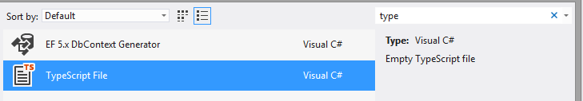

# Add TypeScript Definitions for the Telerik UI for ASP.NET AJAX Suite


This article explains how to obtain and add the __TypeScript definitions__	available for the T__elerik UI for ASP.NET AJAX__ suite.

## Locating the TypeScript Definitions

As of __Q3 2014__, __TypeScript definitions__ are available for the Telerik UI for ASP.NET AJAX suite.They are located in the __TypeScriptDefinitions__ folder in the installation directory (e.g.,*C:\Program Files (x86)\Telerik\UI for ASP.NET AJAX QX YYYY\TypeScriptDefinitions*).

The folder contains the __Telerik.Web.UI.d.ts__ file which holds the definitions for our objectsand the __microsoft.ajax.d.ts__ file for the MS AJAX framework objects. You can alternatively obtain the latter from theInternet in case Microsoft release an updated version.

## Adding the TypeScript Definitions Manually

__TypeScript__ files need to be compiled to JavaScript files, so they are available only in __WebApplication__types of projects.

The following steps will guide you adding the __TypeScript__ definitionsin the application’s project:

1. Copy the __TypeScript__ definitions from the *TypeScriptDefinitions* installation folder to your project.
>caption Figure 1: Adding the Telerik TypeScript Definitions to your project


1. Add a __TypeScript__ file to your project. You can easily find it by using the *Search Installed Templates* textbox in thetop right hand corner:
>caption Figure 2: Adding a TypeScript file to the project



>tip If you do not see the __TypeScript__ File option, you need to add __TypeScript__ support to your Visual Studio by installing the[TypeScript Tools for Visual Studio](http://visualstudiogallery.msdn.microsoft.com/fa041d2d-5d77-494b-b0ba-8b4550792b4d).
>You may also find useful the[Web Essentials package](http://visualstudiogallery.msdn.microsoft.com/07d54d12-7133-4e15-becb-6f451ea3bea6)that adds similar features, including side-by-side TypeScript/JavaScript split screen.
>


1. For Visual Studio 2012 and 2013 versions prior to 2013 Update 2, you are likely to need to modify the *csproj / vbproj* fileto enable the __TypeScript__ to JavaScript translation. To do this:

1. Unload the project (right click on the solution and select Unload Project).

1. Go to the project folder and open the `<projectName>.csproj / <projectName>.vbproj` file with a text editor.

1. Add the following Import directive if you do not see it already.

````XML
			<import project="$(VSToolsPath)\TypeScript\Microsoft.TypeScript.targets" condition="Exists('$(VSToolsPath)\TypeScript\Microsoft.TypeScript.targets')" />
````


1. Reload the project into Visual Studio.This should allow your Visual Studio to compile the __TypeScript__ files to JavaScript files with the same name when you save them.

1. Reference the JavaScript files that will be generated on your page. To do this, simply replace the **.ts*extension with **.js*. The generated *.js file will be excluded by the solution by default:
>caption Figure 3: Referencing a JavaScript file generated by a TypeScript file


1. Write your code as if it were in a standard JavaScript file. This means that you cannot use server code blocks and that browserswill tend to cache this file, so you need to do a full reload (usually Ctrl+F5) to get the new version.

## Adding the TypeScript Definitions from the Configuration Wizard

When you create a Web Application with the help of the[Telerik Creation and Configuration Wizard](), you can add the __TypeScript__ definitions needed with a single click of a checkbox.
>caption Figure 4: Using Configuration Wizard to add TypeScript definitions to the project.


# See Also

 * [What is TypeScript]()

 * [Use TypeScript for the Telerik UI for ASP.NET AJAX Suite]()
