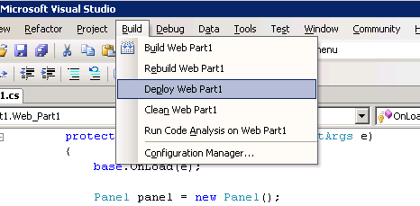
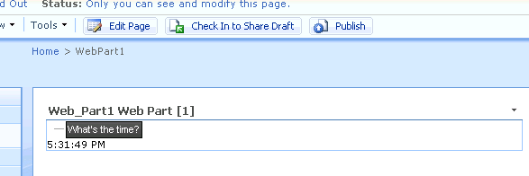

# Create an AJAX-enabled SharePoint WebPart that uses the Telerik Controls

This article shows how to create an AJAX-enabled SharePoint WebPart that uses Telerik controls.

* The article assumes that you already have ASP.NET AJAX installed and configured on the target MOSS installation. If haven’t, you can follow [this excellent blog post by Mike Ammerlaan](http://sharepoint.microsoft.com/blogs/mike/Lists/Posts/Post.aspx?ID=3).

* The next step is to deploy Telerik UI for ASP.NET AJAX to the SharePoint server. You can find instructions at [Deploying Telerik UI for ASP.NET AJAX]()

* To simplify creating, deploying and debugging the web part, we’ll use the ‘Visual Studio extensions for Windows SharePoint Services’. These extensions can be found at the following URLs:

	For Visual Studio 2005:[http://www.microsoft.com/downloads/details.aspx?FamilyID=3E1DCCCD-1CCA-433A-BB4D-97B96BF7AB63&displaylang=en](http://www.microsoft.com/downloads/details.aspx?FamilyID=3E1DCCCD-1CCA-433A-BB4D-97B96BF7AB63&displaylang=en)

	For Visual Studio 2008:[http://www.microsoft.com/downloads/details.aspx?familyid=7BF65B28-06E2-4E87-9BAD-086E32185E68&displaylang=en](http://www.microsoft.com/downloads/details.aspx?familyid=7BF65B28-06E2-4E87-9BAD-086E32185E68&displaylang=en)

* Create a new WebPart project in Visual Studio:

	

* Add the following code:

	**C#**

		protected override void OnInit(EventArgs e)
		{
			base.OnInit(e);
			Page.ClientScript.RegisterStartupScript(typeof(Web_Part1), this.ID, "_spOriginalFormAction = document.forms[0].action;_spSuppressFormOnSubmitWrapper=true;", true);
			if (this.Page.Form != null)
			{
				string formOnSubmitAtt = this.Page.Form.Attributes["onsubmit"];
				if (!string.IsNullOrEmpty(formOnSubmitAtt) && formOnSubmitAtt == "return _spFormOnSubmitWrapper();")
				{
					this.Page.Form.Attributes["onsubmit"] = "_spFormOnSubmitWrapper();";
				}
			}
		}

	As explained in the linked blog post, we need this code to get ASP.NET AJAX working properly. You need to pass the typeof of the current WebPart to the RegisterStartupScript method.

* To use ASP.NET AJAX, you need a ScriptManager control on the page. The blog post explained how to add the ScriptManager to a SharePoint MasterPage. Alternatively, you can add the ScriptManager from the code of the WebPart itself as demonstrated here. Add the following to the OnInit method:

	**C#**

			ScriptManager scriptManager = ScriptManager.GetCurrent(this.Page);
			if (scriptManager == null)
			{
				scriptManager = new RadScriptManager();
				this.Page.Form.Controls.AddAt(0, scriptManager);
			}

	It’s important to note that the ScriptManager is created during the Init event. Creating it in the CreateChildControls method may cause problems as this method is sometimes called too late in the Page’s lifecycle.We can use the RadScriptManager instead of the regular ScriptManager. You can read more about the RadScriptManager at [RadScriptManager]().

* For the RadScriptManager to work, you need to register its HttpHandler. To do this, add the following in the `<httpHandlers>` section of SharePoint’s web.config:

	**XML**

	    <add verb="*" path="Telerik.Web.UI.WebResource.axd" type="Telerik.Web.UI.WebResource, Telerik.Web.UI" />

* This is all the preparation you need to start using Telerik controls in your WebParts. Simply override the OnLoad method and add your controls there:

	**C#**

		protected override void OnLoad(EventArgs e)
		{
			base.OnLoad(e);
			Panel panel = new Panel();
			panel.ID = "Panel1";
			this.Controls.Add(panel);
			RadTreeView treeView = new RadTreeView();
			treeView.ID = "RadTreeView1";
			treeView.Nodes.Add(new RadTreeNode("What's the time?"));
			treeView.NodeClick += new RadTreeViewEventHandler(treeView_NodeClick);
			panel.Controls.Add(treeView);
			label = new Label();
			label.Text = "This is a label";
			panel.Controls.Add(label);
			RadAjaxManager ajaxManager = RadAjaxManager.GetCurrent(this.Page);
			if (ajaxManager == null)
			{
				ajaxManager = new RadAjaxManager();
				ajaxManager.ID = "RadAjaxManager1";
				Controls.Add(ajaxManager);
				this.Page.Items.Add(typeof(RadAjaxManager), ajaxManager);
			}
			ajaxManager.AjaxSettings.AddAjaxSetting(treeView, panel);
		}
		void treeView_NodeClick(object sender, RadTreeNodeEventArgs e)
		{
			label.Text = DateTime.Now.ToLongTimeString();
		}

	There is one difference from a non-SharePoint scenario. When you are using RadAjaxManager, you need to call the following code upon creating it:

	**C#**

			this.Page.Items.Add(typeof(RadAjaxManager), ajaxManager);

* You can now use the Deploy Web Part option in the Build menu to build and deploy the Web Part to SharePoint.You should now be able to add the Web Part to your pages:

	

* Clicking the TreeView node will result in an AJAX update of the Label.

	
