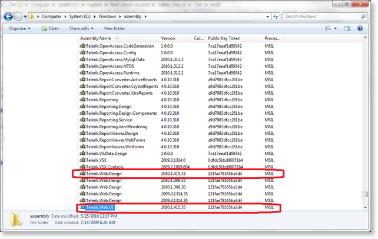

# Deploying Telerik® UI for ASP.NET AJAX


To leverage Telerik® UI for ASP.NET AJAX, some required files must be deployed to each SharePoint Web Front End (WFE) server. Once the required files are deployed, our ASP.NET AJAX can be added to the site by editing the site’s master page(s).

This section outlines the required steps that need to be taken to deploy Telerik® UI for ASP.NET AJAX prior to implementing it within an existing SharePoint web site.

1. First you need to install Telerik.Web.UI.dll and Telerik.Web.Design.dll in the GAC (Global Assembly Cache) of your SharePoint server. There are two ways to do this:

a. Drag and drop **Telerik.Web.UI.dll** and **Telerik.Web.Design.dll** into C:\Windows\Assembly (in Windows Explorer)




b. Open Visual Studio 2005/2008/2010 Command Prompt and run the following commands (assuming Telerik.Web.UI.dll and Telerik.Web.Design.dll are in c:\Telerik) 

**`gacutil -i c:\Telerik\Telerik.Web.UI.dll`**

**`gacutil -i c:\Telerik\Telerik.Web.Design.dll`**

>note If you use version prior to **Q1 2009** you need to install merely **Telerik.Web.UI.dll** in the GAC (Telerik.Web.Design.dll is IL merged in this version).


2. Next you should tell SharePoint that the controls from the Telerik.Web.UI.dll (and Telerik.Web.Design.dll) are safe to use. To do so you should add a few **`<SafeControl>`** entries within the **`<SafeControls>`** section in your web.config:


````XML
<SafeControl Assembly="Telerik.Web.UI, Version=x.x.x.x, Culture=neutral, PublicKeyToken=121fae78165ba3d4" 
	        Namespace="Telerik.Web.UI" TypeName="*" Safe="True" />
<SafeControl Assembly="Telerik.Web.UI, Version=x.x.x.x, Culture=neutral, PublicKeyToken=121fae78165ba3d4" 
	        Namespace="Telerik.Web.Design" TypeName="*" Safe="True" />
````


>note Note that the version of the assembly is specified in each **`<SafeControl>`** tag. If deploying a different version of Telerik® UI for ASP.NET AJAX, ensure that the version number is correct here.


3. [*Optional*] In order to use [RadScriptManager](http://www.telerik.com/help/aspnet-ajax/radscriptmanager.html) (instead of the standard ScriptManager control) or controls like RadBinaryImage, RadChart, RadUpload, etc., you need to register their handlers in the respective section in the web.config:

````XML
<system.webserver>  
    <modules>  
        <add name="RadUploadModule" type="Telerik.Web.UI.RadUploadHttpModule" preCondition="managedHandler" />  
    ...................................  
    </modules>  
    <handlers>  
        <add name="ChartImage.axd_*" path="ChartImage.axd" verb="*" type="Telerik.Web.UI.ChartHttpHandler, Telerik.Web.UI, Culture=neutral, PublicKeyToken=121fae78165ba3d4" preCondition="integratedMode" />  
        <add name="Telerik.Web.UI.SpellCheckHandler.axd_*" path="Telerik.Web.UI.SpellCheckHandler.axd" verb="*" type="Telerik.Web.UI.SpellCheckHandler, Telerik.Web.UI, Culture=neutral, PublicKeyToken=121fae78165ba3d4" preCondition="integratedMode" />  
        <add name="Telerik.Web.UI.DialogHandler.aspx_*" path="Telerik.Web.UI.DialogHandler.aspx" verb="*" type="Telerik.Web.UI.DialogHandler, Telerik.Web.UI, Culture=neutral, PublicKeyToken=121fae78165ba3d4" preCondition="integratedMode" />  
        <add name="Telerik.RadUploadProgressHandler.ashx_*" path="Telerik.RadUploadProgressHandler.ashx" verb="*" type="Telerik.Web.UI.Upload.RadUploadProgressHandler" preCondition="integratedMode" />  
        <add name="Telerik.Web.UI.WebResource.axd_*" path="Telerik.Web.UI.WebResource.axd" verb="*" type="Telerik.Web.UI.WebResource" preCondition="integratedMode" />  
    </handlers>  
    <validation validateIntegratedModeConfiguration="false"/>  
</system.webserver>
````


````XML
<httpHandlers>  
    <remove verb="*" path="*.asmx" />  
    ...................  
        <add verb="*"path="Telerik.RadUploadProgressHandler.ashx" type="Telerik.Web.UI.Upload.RadUploadProgressHandler" />  
        <add verb="*"path="Telerik.Web.UI.DialogHandler.aspx"type="Telerik.Web.UI.DialogHandler, Telerik.Web.UI, Culture=neutral, PublicKeyToken=121fae78165ba3d4" />  
        <add verb="*"path="Telerik.Web.UI.SpellCheckHandler.axd" type="Telerik.Web.UI.SpellCheckHandler, Telerik.Web.UI, Culture=neutral, PublicKeyToken=121fae78165ba3d4" />  
        <add verb="*"path="ChartImage.axd"type="Telerik.Web.UI.ChartHttpHandler, Telerik.Web.UI, Culture=neutral, PublicKeyToken=121fae78165ba3d4" validate="false" />  
        <add path="Telerik.Web.UI.WebResource.axd"verb="*"type="Telerik.Web.UI.WebResource" validate="false" />  
</httpHandlers>
<httpModules>  
    <add name="RadUploadModule"type="Telerik.Web.UI.RadUploadHttpModule" />  
    ...  
</httpModules>
````


4. [*Optional*] In order to use **RadEditor for SharePoint**and the .NET 3.5 version of Telerik® UI for ASP.NET AJAX you need to paste the following **`<dependentAssembly>`** elements in the **`<assemblyBinding>`** tag in the web.config file:

````XML
<dependentAssembly>
    <assemblyIdentity name="Telerik.Web.UI" publicKeyToken="121fae78165ba3d4"/>
    <bindingRedirect oldVersion="1.0.0.0-x.x.x.20" newVersion="x.x.x.35"/>
</dependentAssembly>
<dependentAssembly>
     <assemblyIdentity name="Telerik.Web.Design " publicKeyToken="121fae78165ba3d4"/>
     <bindingRedirect oldVersion="1.0.0.0-x.x.x.20" newVersion="x.x.x.35"/>
</dependentAssembly>
````


