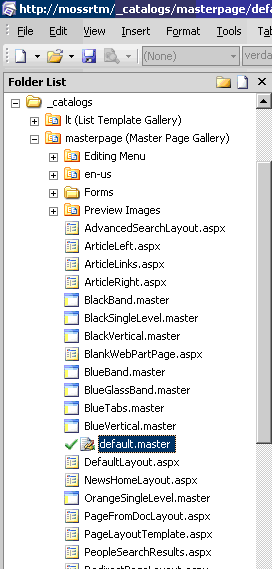
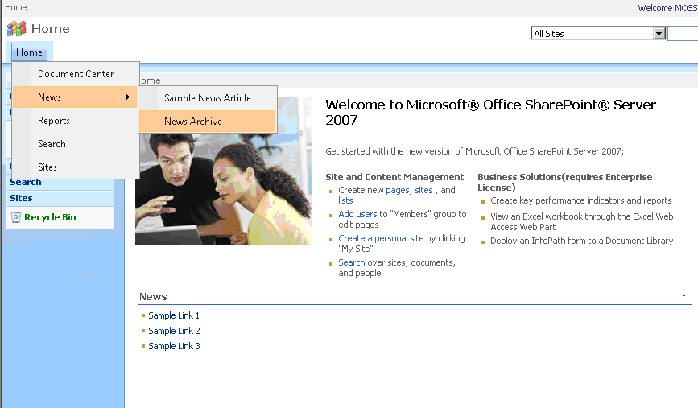

# Incorporating Telerik® UI for ASP.NET AJAX in SharePoint WebSites


Once all steps from the previous articles have been performed, you can easily integrate Telerik® UI for ASP.NET AJAX in your SharePoint site.

The following steps outline how to swap the default SharePoint navigation with **RadMenu**:

1. Launch Office SharePoint designer and open the desired SharePoint site

1. Within the Folder List tool window expand the tree until the master pages folder is visible. A typical location is **http://server_name/_catalogs/masterpage**




1. Open the master page currently used by your site (e.g. default.master). If prompted to check out the file select “Yes”.

1. Now you need to register the Telerik.Web.UI assembly in the master page. Do so by adding the following directive just above the **`<html>`** tag:

````XML
<%@ register tagprefix="telerik" namespace="Telerik.Web.UI" assembly="Telerik.Web.UI, Version=x.x.x.x, Culture=neutral, PublicKeyToken=121fae78165ba3d4" %>
````


>tip Note that the version of the assembly is specified in the Assembly attribute. If deploying a different version of Telerik® UI for ASP.NET AJAX, ensure that the version number is correct here.


1. Since RadMenu is ASP.NET Ajax control, it requires a ScriptManager control to be present on the page. Add the following markup just after the beginning of the **`<form>`** tag:

````ASP.NET
<asp:ScriptManager runat="server" ID="ScriptManager1" />
````

Alternatively, you can use [RadScriptManager]() ([how to register its handler]()).

1. Find the `<SharePoint:AspMenu ID=”TopNavigationMenu”>` tag and delete it.

1. Add the following code where the SharePoint menu tag was:

````ASP.NET
<telerik:RadMenu ID="RadMenu1" runat="server" DataSourceID="topSiteMap" Skin="Office2007" />
````


1. Verify that the **DataSourceID** property of RadMenu is set to the same value as the **ID** property of the desired SiteMapDataSource control.

1. Save your master page file and check it in. If you check your page in the browser you should see that RadMenu has replaced the default SharePoint menu.
 



1. You can use **RadTreeView**, **RadPanelBar** or **RadTabStrip** by simply replacing the “**RadMenu**” tag e.g.:

````ASP.NET
<telerik:RadTreeView ID="RadTreeView1" runat="server" DataSourceID="topSiteMap" />
````


>tip If you intend to integrate RadAjaxManager inside your SharePoint webpart, review the information from [this help article]().
>

