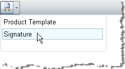

# Code Snippets


## 
>caption 




The Code snippets dropdown is a convenient tool for inserting predefined chunks of content (HTML) like signatures, product description templates, custom tables, etc. These chunks of content are kept in the __Snippets__ collection. You can add to the Snippets collection by modifying the __ToolsFile.xml / ListToolsFile.xml__ files, located in the following folder:

/Program Files/Common Files/Microsoft Shared/web server extensions/wpresources/RadEditorSharePoint/5.x.x.0__1f131a624888eeed/Resources/

For the HTML code to be interpreted correctly in the XML file, enclose the code in __<![CDATA[ &cd;>__ as shown in the example below:

````XML
	    <snippets>
	          <snippet name="Product Template">
	             <![CDATA[
	                <div style="width:300px;border:2px outset #D8D2BD;padding:34px;font-family:Arial, Verdana; font-size:11px;background- color:#F1EFE6;">
	        Dear ____________________,<br>
	        Thank you for inquiring about ____________. Your request will be processed in 48 hours and shipped at the address you have provided.
	        <b>Please, contact us if you have any problems.</b>
	        </div>
	             ]]>
	         </snippet>
	          <snippet name="Signature">
	             <![CDATA[
	                <strong>John Smith</strong><br>Sales Manager<br>
	                ...
	                ************************************************
	             ]]>
	          </snippet>
	    </snippets>
````


To set an image icon in an "Insert Code Snippet" item, put an IMG tag either in front of or next to the Title inside the name attribute of the respective snippet tag:<snippet name="&lt;img src='http://www.telerik.com/RadControls/Editor/Skins/Custom/buttons/AjaxSpellCheck.gif' /&gt;Order Confirmation">

You should also encode the < and > tags symbols of the IMG tag with &lt; and &gt;.
