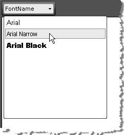

# Fonts



The WYSIWYG Fonts dropdown of RadEditor display a predefined set of fonts which by default are: Arial, Comic Sans MS, Courier New, Tahoma, Times New Roman and Verdana. All fonts are set using the FontNames Collection.You can predefine the FontNames Collection by modifying the **ToolsFile.xml** / **ListToolsFile.xml** files, located in the following folder:

*/Program Files/Common Files/Microsoft Shared/web server extensions/wpresources/RadEditorSharePoint/5.x.x.0**1f131a624888eeed/Resources/*

**For example:**

````XML
<root>
   <tools name="MainToolbar" enabled="true">
   <tool name="FontName" />
   </tools>   
	 <fontNames>
	   <item name="Arial" />
	   <item name="Arial Narrow" />
	   <item name="Arial Black" />
	 </fontNames>
</root> 
````

>note The fonts must be available on the client machine.

## Encoding for Internationalization

RadEditor is powerful enough to be used in any language you like: English, Bulgarian, Russian, Hindi, Vietnamese, Chinese, Japanese, Korean, etc.

You'll need to set the proper encoding in the aspx files with the editor. You can use the following encoding: `<?xml version="1.0" encoding="utf-8" ?>`, which will make the editor compatible with Western Europe languages, Cyrillic, Greek, Asian, Arab, Chinese, Japanese, etc characters.

>note If the characters are displayed properly by the browser on the same page where the editor is, they should be displayed properly in the editor as well.

