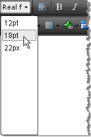

# Real Font Sizes


## 
>caption 




The Real Font Sizes dropdown displays a predefined set of font sizes in pixels and points. The dropdown is populated from the RealFontSizes Collection. You can predefine the Real Font Sizes in the RealFontSizes Collection by modifying the __ToolsFile.xml / ListToolsFile.xml__ files, located in the following folder:

/Program Files/Common Files/Microsoft Shared/web server extensions/wpresources/RadEditorSharePoint/5.x.x.0__1f131a624888eeed/Resources/

__For example:__

````XML
	    <root>
	     <tools name="MainToolbar" enabled="true">
	        <tool name="RealFontSize" />
	     </tools>
	     <realFontSizes>
	        <item value="12pt"></item>
	        <item value="18pt"></item>
	        <item value="22px"></item>
	     </realFontSizes>
	    </root>
````


