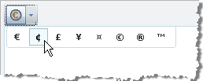

# Symbols



The RadEditor Symbols dropdown by default displays a predefined set of symbols. They are kept in the Symbols Collection. You can easily predefine the Symbols collection by modifying the **ToolsFile.xml** / **ListToolsFile.xml** files, located in the following folder:

*/Program Files/Common Files/Microsoft Shared/web server extensions/wpresources/RadEditorSharePoint/5.x.x.0**1f131a624888eeed/Resources/*

**For example:**

````XML
<root>
	<tools name="MainToolbar" enabled="true">
			<tool name="InsertSymbol" />
	</tools>
	<symbols>
		<symbol value="\u20AC" />
			<symbol value="\u00A2" />
			<symbol value="\u00A3" />    
			<symbol value="\u00A5" />    
			<symbol value="\u00A4" />    
			<symbol value="\u00A9" />    
			<symbol value="\u00AE" />    
			<symbol value="\u2122" />  
	</symbols>
</root>
````


Here is a complete list of the symbols populated by default the "Insert Symbols" dropdown:

`[\u20AC, \u00A, \u00A3, \u00A5, \u00A4, \u00A9, \u00AE, \u2122, u00B1, \u2260, \u2248, \u2264, \u2265, \u00F7, \u00D7, \u221E, \u00BD, \u00BC, \u00BE, \u00B2, \u00B3, \u2030, \u00B6, \u00A7, \u03B1, \u03B2, \u03B1, \u002E, \u0394, \u00B5, \u03A9, \u2211, \u00D8, \u2220, \u00BA, u00AB, \u00BB, \u00B7, \u2022, \u2020, \u2021, \u0192]`
