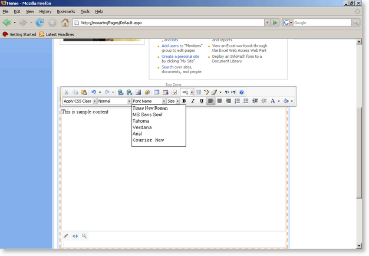

# Frequently Asked Questions

**Editor Not Active**

Q: The page with RadEditor opens but the editor content area is not active and none of the buttons have any effect. What is the problem?

A: This happens when there is a problem with the editor client scripts and the editor is not initialized properly. For example, if there is a piece of custom JavaScript on the page with an error, it could prevent all client controls after it (including the editor) from initializing properly. Another very common cause for this problem is that the editor scripts are not loaded on the page at all. Make sure that the ASP.NET AJAX extensions are correctly configured in the SharePoint application's Web.config file. You can find more information about this in our help - [Extending your MOSS site with Microsoft ASP.NET AJAX 1.0]().

**RadEditor is not available for all sites**

Q: We have multiple web applications on our development server. I have installed the RadEditor and activated the feature for one site. But when I edit a list item on a different site it seems that the RadEditor is not available there. Is this a bug?

A: This is default behavior. The scope of the RadEditor features has been changed to Site level. This means that you have to activate the feature for each site where you wish to use our editor. Alternatively, you can change the scope of the features and activate them for the whole site collection. See the following page for more details - [Change RadEditor Features Scope]()

**UNIX and Linux support**

Q: Will RadEditor provide support for Linux and Unix users or is it just for PC and Mac?

A: Telerik RadEditor for MOSS fully supports Firefox and Mozilla browsers. This means that a user who is running one of these browsers on a Unix/Linux/BSD platform, will be able to take advantage of the rich text editing capabilities of RadEditor. Since those browsers are multi platform, it does not matter whether you are accessing the MOSS site from Windows/Mac OS X/Linux. The editor will work on all of those operating systems.

**Is the RadEditor available for Wiki content?**

Wiki content in MOSS is represented as a list. This means that if you activate the RadEditor for list items in the Wiki site, you will be able to use it to edit the content of the Wiki pages. See [Using RadEditor in List Items]() for more information

**Docked toolbar in WCM scenario**

Q: Is there any way to get the ToolbarMode to use Default mode (docked) rather than ShowOnFocus?

A: The original idea of the editor is to keep the user experience as close as possible to that of the default rich-text editor. As a result RadEditor from MOSS was implemented with the same ShowOnFocus toolbar mode. If you want to change it, you will need to modify the editor's configuration file (see [Set Properties Via Config File]()).

**Solution cannot be deployed or retracted**

Sometimes a deployment/retracting job will hang. If the job is not finished in a reasonable time period (10 min), then you need to check if the SharePoint Administration service is running. If the service is stopped then the solution job cannot be executed.

Open the Services window from the Administrative Tools and locate the **Windows SharePoint Services Administration** service. Ensure that the service is in the Running state.

**Get the UID of a SharePoint Web with RadEditor for MOSS**

We have provided an easy way for you to get the UID of a Web, using the RadEditor for MOSS. First you need to open the SharePoint Web Application's Web.config file and add a new application setting. The Web.config file is located by default at **C:\Inetpub\wwwroot\wss\VirtualDirectories\(port)\web.config**, where **(port)** is the port of the web application - for example *C:\Inetpub\wwwroot\wss\VirtualDirectories\80\web.config*.

The new application setting must be called **RadEditorSaveGuids**. The value can be any string you want. For example:

	<appSettings>

		<add key="RadEditorSaveGuids" value="1" />

	</appSettings>

Save the Web.config file and open the site in your browser. Finally, navigate to the site with RadEditor and open it for editing:
>caption 

After that, open the RadControls\Editor\ folder and you should see a file, called guids.config. This file will contain the URL of the page you just opened, along with the Web UID and a timestamp. For example:

In the above example the file **\Program Files\Common Files\Microsoft Shared\web server extensions\wpresources\RadEditorSharePoint\5.x.x.0**1f131a624888eeed\Resources\guids.config** will contain

/Pages/Default.aspx10/1/2007 10:00:58 AM - GUID: {a63cff5e-cdf5-48d0-898d-f9a24d299f06}

In this case the UID for the site is *{a63cff5e-cdf5-48d0-898d-f9a24d299f06}*.

>note: Remember to remove the **RadEditorSaveGuids** application setting when you no longer need it (i.e. after you find the UID you want).

**Size of editing area in WCM scenario**

You can control the size (width/height) of the RadEditor content fields in WCM scenario using the DisplayHeight and DisplayWidth properties of the RadHtmlField control.
