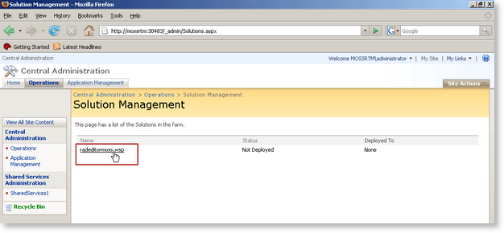

# Installing RadEditor in a MOSS 2007 farm

Follow the steps below to install Telerik RadEditor for MOSS on your SharePoint 2007 farm.

1. Extend your MOSS site with [ASP.NET AJAX 1.0]() or [ASP.NET AJAX 3.5]()

2. Extract the contents of **RadEditorMOSS_5_x_x_Dev.zip** or (**RadEditorMOSS_5_x_x_Trial.zip** - if you are using the trial version) to a folder of your choice on the MOSS server.

3. Open a command prompt window.

4. Run the **stsadm.exe** utility to install **RadEditorMOSS**solution. By default **stsadm.exe** can be found in **[Program Files]\Common Files\Microsoft Shared\web server extensions\12\BIN**.

	Use the following syntax:
	
	`stsadm -o addsolution -filename [Path]\RadEditorMOSS.wsp`
	
	

5. Open the SharePoint **Central Administration** page.

	

6. Go to the **Operations** page and click on **Solution Management**.

	

7. You should see the **radeditormoss.wsp** solution in the list. Click on the name link to go to the **Solution Properties** page.

	

8. Select **Deploy Solution**.

	

9. From the next page you can choose when and to which applications to deploy the solution.

	

10. After a successful deployment you will see the following screen:

	

>note  If you see the following exception - "Request for permission of type..." when you try to open a page containing the editor, then you might need to modify the web.config of your SharePoint application and set the Trust level to at least Medium level. This can happen if you choose to deploy the editor solution to a single site (in the BIN folder) instead of to all sites (in the GAC).

