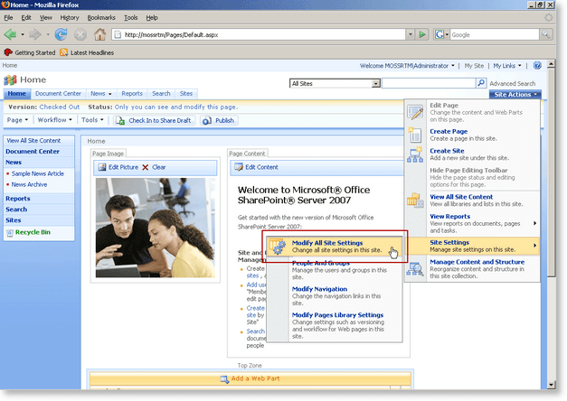
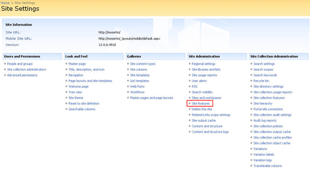
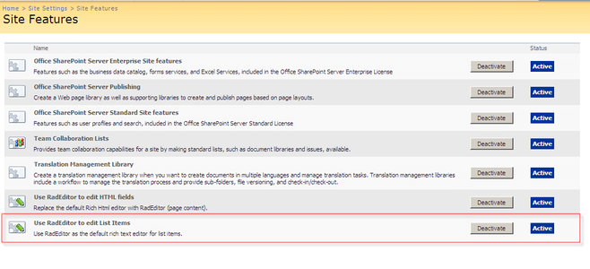
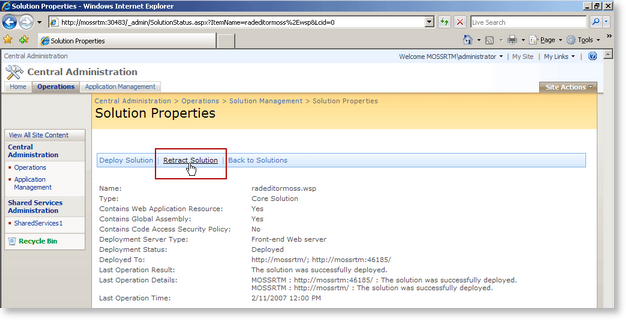
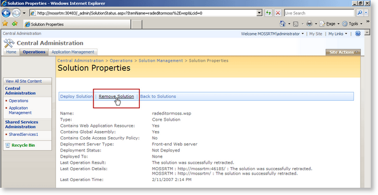

# Uninstalling RadEditor


## 

In order to uninstall RadEditor for MOSS you need to first perform the following preliminary tasks. Note that these tasks are needed __ONLY__if you do not plan to upgrade to a newer version of RadEditor for MOSS (e.g. you wish to use only the default MOSS editor again):

1. Revert to the default rich-text editor in Web Content Management scenario (do the reverse actions of the ones described in [Using RadEditor in Web Content Management scenario]()).

1. Open the page(s) in which you have used RadEditor for MOSS.

1. Replace the RadEditor tags (telerik:RadHtmlField) with the default editor tags:

````XML
	    <PublishingWebControls:RichHtmlField runat="server" id="Content" FieldName="..." />
````


1. Remove the RadEditor registration line from the top of the page:

````XML
	<%@ Register TagPrefix="telerik" Namespace="Telerik.SharePoint.FieldEditor" Assembly="RadEditorSharePoint, Version=x.x.x.x, Culture=neutral, PublicKeyToken=1f131a624888eeed" %>
````


1. Replace all instances of the RadEditor Web Part with the default rich-text editor Web Part:

1. Open a given page for editing

1. Copy the content of a given RadEditor Web Part

1. Delete this RadEditor Web Part

1. lace a default rich-text editor Web Part on its place

1. Paste to copied content inside the Web Par and save it

1. Repeat steps b-e for all RadEditor Web Parts on the page

Once you have performed steps 1 and 2 as described above, please do the following to uninstall Telerik RadEditor from your MOSS 2007 site:

1. Open your SharePoing site in the browser. From the __Site Actions__ menu go to __Site Settings > Modify All Site Settings__
>caption 



1. Click __Site features__ link from the Site Administration column.
>caption 



1. Scroll to the bottom of the list and deactivate the RadEditor features.
>caption 



1. Open the SharePoint __Central Administration__ page.

1. Go to the __Operations__ page and click on __Solution Management__.
>caption 


1. You should see the __radeditormoss.wsp__ solution in the list. Click on the name link to go to the __Solution Properties__ page.
>caption 


1. Choose __Retract Solution__. On the next page choose when and from which solutions to retract the RadEditor. Then click __Ok__.
>caption 



1. Wait a few minutes. Then refresh the page. The retraction process should be over and you should see the following screen:
>caption 


1. Click the name link to open the __Solution Properties__ page again. This time click the __Remove Solution__ button. Then confirm in the dialog box. The solution should be removed from the farm and a confirmation screen will be displayed.
>caption 



1. To prevent errors caused by caching, open a command prompt window and type __iisreset__ to reset the Internet Information Server.

# See Also

 * [Using RadEditor in Web Content Management scenario]()
