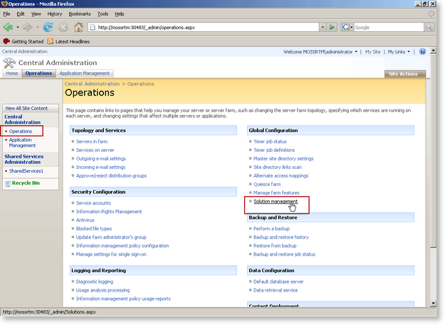

# Uninstalling RadEditor

In order to uninstall RadEditor for MOSS you need to first perform the following preliminary tasks. Note that these tasks are needed **ONLY** if you do not plan to upgrade to a newer version of RadEditor for MOSS (e.g. you wish to use only the default MOSS editor again):

1. Revert to the default rich-text editor in Web Content Management scenario (do the reverse actions of the ones described in [Using RadEditor in Web Content Management scenario]()).

1. Open the page(s) in which you have used RadEditor for MOSS.

1. Replace the RadEditor tags (telerik:RadHtmlField) with the default editor tags:

	**XML**

	    <PublishingWebControls:RichHtmlField runat="server" id="Content" FieldName="..." />

1. Remove the RadEditor registration line from the top of the page:

	**XML**

		<%@ Register TagPrefix="telerik" Namespace="Telerik.SharePoint.FieldEditor" Assembly="RadEditorSharePoint, Version=x.x.x.x, Culture=neutral, PublicKeyToken=1f131a624888eeed" %>

1. Replace all instances of the RadEditor Web Part with the default rich-text editor Web Part:

	1. Open a given page for editing
	
	1. Copy the content of a given RadEditor Web Part
	
	1. Delete this RadEditor Web Part
	
	1. lace a default rich-text editor Web Part on its place
	
	1. Paste to copied content inside the Web Par and save it
	
	1. Repeat steps 2-5 for all RadEditor Web Parts on the page

Once you have performed steps 1 and 2 as described above, please do the following to uninstall Telerik RadEditor from your MOSS 2007 site:

1. Open your SharePoint site in the browser. From the **Site Actions** menu go to **Site Settings > Modify All Site Settings**

	

1. Click **Site features** link from the Site Administration column.

	

1. Scroll to the bottom of the list and deactivate the RadEditor features.

	

1. Open the SharePoint **Central Administration** page.

1. Go to the **Operations** page and click on **Solution Management**.

	

1. You should see the **radeditormoss.wsp** solution in the list. Click on the name link to go to the **Solution Properties** page.

	

1. Choose **Retract Solution**. On the next page choose when and from which solutions to retract the RadEditor. Then click **Ok**.

	

1. Wait a few minutes. Then refresh the page. The retraction process should be over and you should see the following screen:

	

1. Click the name link to open the **Solution Properties** page again. This time click the **Remove Solution** button. Then confirm in the dialog box. The solution should be removed from the farm and a confirmation screen will be displayed.

	

1. To prevent errors caused by caching, open a command prompt window and type **`iisreset`** to reset the Internet Information Server.

## See Also

 * [Using RadEditor in Web Content Management scenario]()
