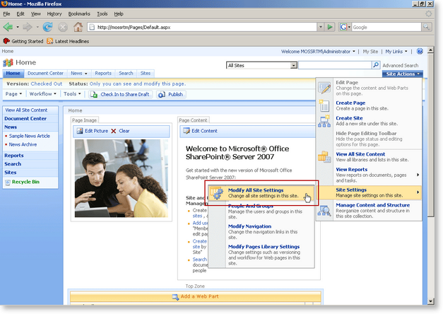
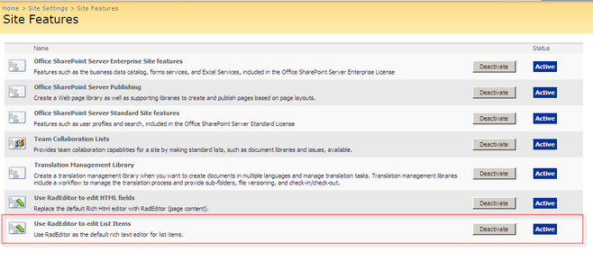

# Using RadEditor in List Items

## 

Most of the Office SharePoint Server features are represented as lists. For example, __Wiki content__, __Blogs__, __announcements__, etc. You can easily replace the editor in these cases with the RadEditor.

>note  __NOTE:__ Once the RadEditor for MOSS features are activated they will affect only the current site. You need to activate the RadEditor features for each site individually. If you want to change the scope of the features, see the following article -[Change the RadEditor features scope]()
>

1. From the __Site Actions__ menu go to __Site Settings > Modify All Site Settings__
>caption 

1. Click Site features in the Site Administration column
>caption 

1. Scroll to the bottom of the list and activate the __Use RadEditor to edit List Items__ feature.
>caption 

1. __IMPORTANT!__ If you still see the default editor or a simple textbox after you activate the RadEditor feature(s), you might need to open a command prompt window and type __iisreset__ to reset the Internet Information Server. This will prevent problems caused by caching.This screenshot below shows RadEditor used to edit a Task description:
>caption 

# See Also

 * [Using the RadEditor WebPart]()

 * [Using RadEditor in Web Content Management scenario]()
