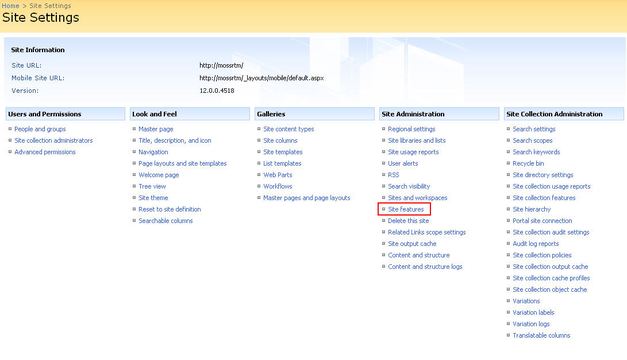

# Using RadEditor in Web Content Management scenario

Telerik RadEditor for MOSS can be easily used as a cross-browser rich-text editor for Web Content Management in SharePoint 2007. In order to replace the default editor in a page template, you need to perform a one-time modification using SharePoint Designer 2007. All content which has been authored through the default editor will be preserved and accessible through the Telerik RadEditor for MOSS.

## Using the new feature

>note  **NOTE:** Once the RadEditor for MOSS features are activated they will affect only the current site. You need to activate the RadEditor features for each site individually. If you want to change the scope of the features, see the following article -[Change the RadEditor features scope]()
>

1. From the **Site Actions** menu go to **Site Settings > Modify All Site Settings**
>caption 

1. Click Site features in the Site Administration column
>caption 

1. Scroll to the bottom of the list and activate the **Use RadEditor to edit HMTL fields** feature.
>caption 

1. **IMPORTANT!** If you still see the default editor or a simple textbox after you activate the RadEditor feature(s), you might need to open a command prompt window and type **iisreset** to reset the Internet Information Server. This will prevent problems caused by caching.

## UsingSharePoint Designer

1. Open a page in the **Microsoft Office SharePoint Designer 2007**. Select the page you wish to modify and choose **Edit Page Layout**.
>caption 

1. At the top, after the default SharePoint Register tags add the following registration line (replace Version=x.x.x.x with the RadEditor for MOSS version, e.g for editor v5.12 use Version=5.1.2.0):<%@ Register TagPrefix="telerik" Namespace="Telerik.SharePoint.FieldEditor" Assembly="RadEditorSharePoint, Version=x.x.x.x, culture=neutral, PublicKeyToken=1f131a624888eeed" %>
>caption 

1. Replace the tag of the default editor **<PublishingWebControls:RichHtmlField ... >**with the RadEditor tag:< telerik:RadHtmlField id="Content" FieldName="..." runat="server"></telerik:RadHtmlField>
>caption 

## See Also

 * [Using the RadEditor WebPart]()

 * [Using RadEditor in List Items]()
