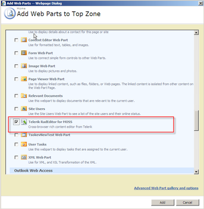

# Using the RadEditor WebPart

## 

RadEditor for MOSS comes with a special Web Part, which you can use as a cross-browser alternative to the default rich-text editor Web Part. Please, note that the deployment process will not automatically replace existing Web Parts with the new RadEditor Web Part. Since there is no supported way of performing this replacement you should [migrate your existing rich-text editor Web Parts]() manually.

Follow the steps below to add a new RadEditor Web Part to a given page.

1. Open your Web Application and browse to a Web Part page.

1. Click the Edit Page button or select Edit Page from the Site Actions menu.
>caption 

1. Click the Add a Web Part button in one of the Web Part Zones.
>caption 

1. Browse to the *Telerik RadEditor for MOSS* web part in the __Miscellaneous__ category, check it and click the Add button.
>caption 

1. To edit the web part content, select "Modify Shared Web Part" in the RadEditor's Edit menu.
>caption 

1. The screenshot below shows RadEditor Web Part in edit mode.
>caption 

1. Once you are done editing the content, click the __Ok__ button in the RadEditor options panel.
>caption 

# See Also

 * [Migrating default rich-text editor Web Parts]()

 * [Using RadEditor in List Items]()

 * [Using RadEditor in Web Content Management scenario]()
