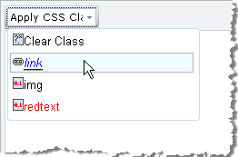

# CSS Styles



The CSS class dropdown of RadEditor displays all classes defined in the page or from external CSS files. The dropdown is populated from the **CssClasses**Collection. By default RadEditor for SP2010 uses the same CSS files as the default rich-text editor. Those files are **HtmlEditorTableFormats.css** and **HtmlEditorCustomStyles.css,** which are located in the following folder:

_/Program Files/Common Files/Microsoft Shared/web server extensions/14/Template/Layouts/1033/Styles_

>note The folder location can be different if you are not using US English version of SharePoint 2010. The 1033 number signifies the current culture and might be different for different language versions of SP2010.

**For example:**

The files which properties need to be modified are **ToolsFile.xml / ListToolsFile.xml**, located in the following folder:

_/Program Files/Common Files/Microsoft Shared/web server extensions/wpresources/RadEditorSharePoint/6.x.x.0__1f131a624888eeed/Resources/_

````XML
<root>  
    <tools name="MainToolbar" enabled="true">    
        <tool name="ApplyClass" />  
    </tools>  
    <classes>    
        <class name="Clear Class" value="" />    
        <class name="Links Class" value="a.link" />    
        <class name="Images Class" value=".img" />    
        <class name="My Red Text" value=".redText" />  
    </classes>
</root>
````


