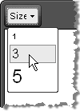

# Font Sizes



## Adding Font Sizes

You can populate the **FontSizes** dropdown by modifying the **ToolsFile.xml / ListToolsFile.xml** files, located in the following folder:

_/Program Files/Common Files/Microsoft Shared/web server extensions/wpresources/RadEditorSharePoint/6.x.x.0__1f131a624888eeed/Resources/_

**For example:**

````XML
<root>  
    <tools name="MainToolbar" enabled="true">    
        <tool name="FontSize" />  
    </tools>  
    <fontSizes>    
        <item>1</item>    
        <item>3</item>    
        <item>5</item>  
     </fontSizes>
</root>
````


If you want to apply font sizes in pixels (px) or in points (pt) then use the [Real Font Size]() dropdown.
