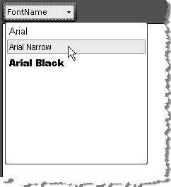

# Fonts





The WYSIWYG Fonts dropdown of RadEditor display a predefined set of fonts which by default are: Arial, Comic Sans MS, Courier New, Tahoma, Times New Roman and Verdana. All fonts are set using the FontNames Collection.You can predefine the FontNames Collection by modifying the **ToolsFile.xml / ListToolsFile.xml** files, located in the following folder:

_/Program Files/Common Files/Microsoft Shared/web server extensions/wpresources/RadEditorSharePoint/6.x.x.0__1f131a624888eeed/Resources/_

**For example:**

````XML
<root>    
    <tools name="MainToolbar" enabled="true">    
        <tool name="FontName" />  
    </tools>    
    <fontNames>    
        <item name="Arial" />    
        <item name="Arial Narrow" />    
        <item name="Arial Black" />  
    </fontNames>
</root>
````

>tip The fonts must be available on the client machine.


## Encoding for Internationalization

RadEditor is powerful enough to be used in any language you like: English, Bulgarian, Russian, Hindi, Vietnamese, Chinese, Japanese, Korean, etc.

You'll need to set the proper encoding in the aspx files with the editor. You can use the following encoding: **`<?xml version="1.0" encoding="utf-8" ?>`**, which will make the editor compatible with Western Europe languages, Cyrillic, Greek, Asian, Arab, Chinese, Japanese, etc characters.

>tip If the characters are displayed properly by the browser on the same page where the editor is, they should be displayed properly in the editor as well.


